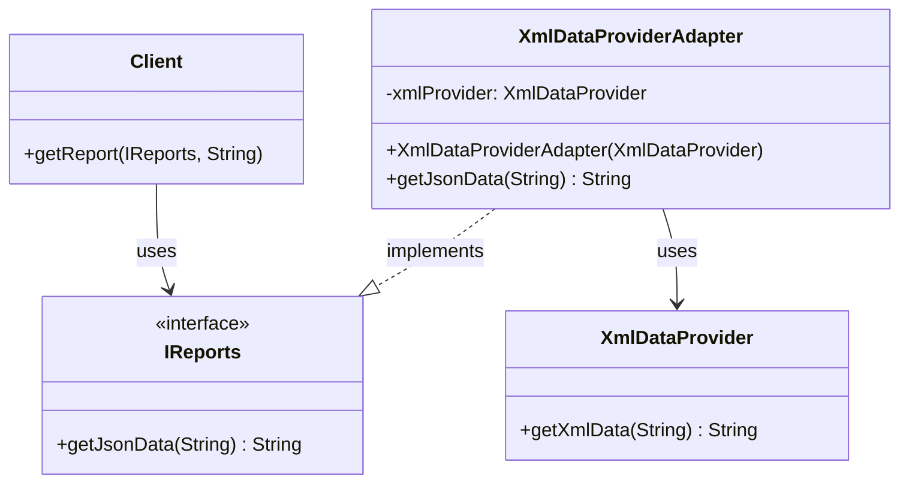

# 🔌 Adapter Design Pattern (Java)

[](https://www.oracle.com/java/)
[](LICENSE)
[](https://en.wikipedia.org/wiki/Adapter_pattern)

The **Adapter Design Pattern** is a structural design pattern that allows objects with incompatible interfaces to work together by acting as a bridge (adapter) between them.

This repository contains a Java implementation where an `XmlDataProvider` (adaptee) provides user data in XML format, but the client expects the data in JSON format. The `XmlDataProviderAdapter` adapts the XML data to the format expected by the client.

## 📖 Pattern Intent

> **"Convert the interface of a class into another interface the client expects."**

The Adapter lets classes work together that couldn't otherwise because of incompatible interfaces.

## 🧩 Architecture Components

### 1. **Target Interface** (`IReports`)

```java
interface IReports {
 String getJsonData(String rawData);
}
```

This is the interface expected by the **client**. It defines the method `getJsonData`, which accepts a raw string and returns JSON.

### 2. **Adaptee** (`XmlDataProvider`)

```java
class XmlDataProvider {
    String getXmlData(String data) {
        int sep = data.indexOf(':');
        String name = data.substring(0, sep);
        String id = data.substring(sep + 1);
        return "<user><n>" + name + "</n><id>" + id + "</id></user>";
    }
}
```

This class provides the actual XML data. It is incompatible with the client, which expects JSON format.

### 3. **Adapter** (`XmlDataProviderAdapter`)

```java
class XmlDataProviderAdapter implements IReports {
    private XmlDataProvider xmlProvider;

    public XmlDataProviderAdapter(XmlDataProvider provider) {
        this.xmlProvider = provider;
    }

    public String getJsonData(String data) {
        String xml = xmlProvider.getXmlData(data);
        // Parse XML and convert to JSON
        return "{\"name\":\"" + name + "\", \"id\":" + id + "}";
    }
}
```

The Adapter implements the `IReports` interface and internally uses the `XmlDataProvider` to get XML data and convert it to JSON.

### 4. **Client**

```java
class Client {
    public void getReport(IReports report, String rawData) {
        System.out.println("Processed JSON: " + report.getJsonData(rawData));
    }
}
```

The client depends only on the `IReports` interface and is completely decoupled from `XmlDataProvider`.

## 🚀 Quick Start

### Prerequisites

- Java 8 or higher
- Any Java IDE or command line

### Running the Example

1. **Clone the repository:**

   ```bash
   git clone <repository-url>
   cd adapter-design-pattern
   ```

2. **Compile and run:**

   ```bash
   javac AdapterDesignPattern.java
   java AdapterDesignPattern
   ```

3. **Expected Output:**
   ```
   Processed JSON: {"name":"Alice", "id":42}
   ```

## � Class Diagram



## � Real-World Analogy

Think of a **power adapter** that converts a two-pin plug to a three-pin plug so that your device can work with a different socket. The adapter doesn't change the device or the socket - it just makes them compatible.

## ✅ When to Use the Adapter Pattern

- ✅ When you want to use an existing class but its interface doesn't match what you need
- ✅ When you need to convert data or functionality to match system expectations
- ✅ When working with legacy code that you cannot modify
- ✅ When integrating third-party libraries with incompatible interfaces

## 🎯 Benefits

- **Reusability**: Allows reuse of existing functionality without modification
- **Separation of Concerns**: Keeps business logic separate from interface conversion
- **Flexibility**: Easy to swap different adapters for different data sources
- **Open/Closed Principle**: Open for extension, closed for modification

## �️ Project Structure

```
├── AdapterDesignPattern.java    # Main implementation file
├── README.md                    # This file
├── Standered_UML.png           # UML diagram
└── *.class                     # Compiled Java files
```

## 🤝 Contributing

1. Fork the repository
2. Create your feature branch (`git checkout -b feature/amazing-feature`)
3. Commit your changes (`git commit -m 'Add amazing feature'`)
4. Push to the branch (`git push origin feature/amazing-feature`)
5. Open a Pull Request

## 📄 License

This project is licensed under the MIT License - see the [LICENSE](LICENSE) file for details.

## 🏷️ Tags

`#design-patterns` `#adapter` `#java` `#structural-pattern` `#object-oriented` `#software-engineering`
