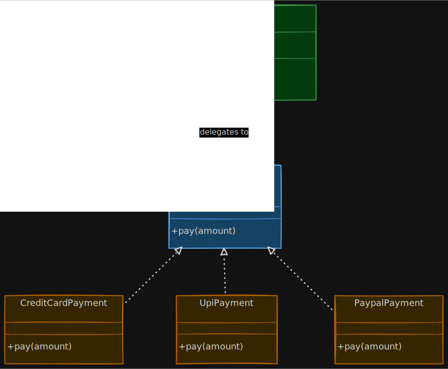
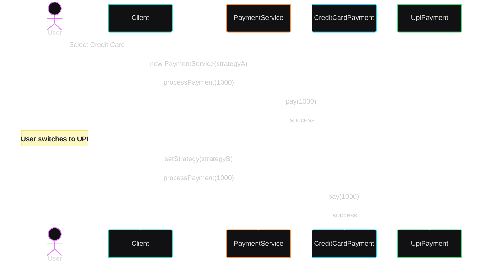

# 🌀 Strategy Design Pattern

The Strategy Design Pattern is one of the most important behavioral design patterns in Low Level Design interviews.

It solves a very common real-world problem:

> “How do we change behavior dynamically without changing existing code?”

Instead of writing giant `if-else` or `switch` statements, Strategy Pattern moves each behavior into separate interchangeable classes.

## 🚨 The Real Problem

Imagine you are building an e-commerce application.

Initially, the company supports only:

- Credit Card payments

So you write:

```java id="yq5hij"
class PaymentService {

    public void pay(String paymentType) {

        if(paymentType.equals("CREDIT_CARD")) {
            System.out.println("Processing credit card payment");
        }
    }
}
```

Everything looks fine.

## 📉 Then Reality Hits

Business requirements grow.

Now product manager says:

- Add UPI
- Add PayPal
- Add Crypto
- Add Wallet
- Add Net Banking

Your code becomes:

```java id="3k5gxg"
class PaymentService {

    public void pay(String paymentType) {

        if(paymentType.equals("CREDIT_CARD")) {

        } else if(paymentType.equals("UPI")) {

        } else if(paymentType.equals("PAYPAL")) {

        } else if(paymentType.equals("CRYPTO")) {

        }
    }
}
```

## 💣 Problems With This Design

Every new payment method requires:

- modifying existing class
- adding more conditionals
- retesting everything
- increasing complexity

This violates:

- Open Closed Principle (OCP)
- Single Responsibility Principle (SRP)

The service becomes:

- rigid
- hard to maintain
- difficult to extend

## 🧠 Core Idea of Strategy Pattern

Instead of storing multiple algorithms inside one class:

✅ Extract each algorithm into separate classes
✅ Make them interchangeable at runtime

The Strategy Pattern defines:

> A family of algorithms, encapsulates each one, and makes them interchangeable at runtime. ([GeeksforGeeks][1])

## ✅ Step-by-Step Solution

### Step 1 — Create Strategy Interface

Define common contract for all payment behaviors.

```java id="1jpuzg"
interface PaymentStrategy {

    void pay(int amount);
}
```

### Step 2 — Create Concrete Strategies

Each payment method becomes separate class.

#### Credit Card Strategy

```java id="c7q4bl"
class CreditCardPayment implements PaymentStrategy {

    @Override
    public void pay(int amount) {
        System.out.println("Paid using Credit Card");
    }
}
```

#### UPI Strategy

```java id="0fjw9l"
class UpiPayment implements PaymentStrategy {

    @Override
    public void pay(int amount) {
        System.out.println("Paid using UPI");
    }
}
```

#### PayPal Strategy

```java id="jlwmrn"
class PaypalPayment implements PaymentStrategy {

    @Override
    public void pay(int amount) {
        System.out.println("Paid using PayPal");
    }
}
```

### Step 3 — Create Context Class

The context delegates behavior to strategy.

```java id="gs1s7j"
class PaymentService {

    private PaymentStrategy strategy;

    PaymentService(PaymentStrategy strategy) {
        this.strategy = strategy;
    }

    public void processPayment(int amount) {
        strategy.pay(amount);
    }
}
```

## 🧠 Important Understanding

PaymentService does NOT know:

- how UPI works
- how PayPal works
- how Card works

It only knows:

```text id="1g25pd"
“Someone will handle payment.”
```

This is abstraction.

## 📊 UML Class Diagram

<!-- [[Strategy_Design_Pattern]] -->



## 🧠 Technical Relationship Understanding

- PaymentService depends on PaymentStrategy using association
- Concrete payment classes realize the interface
- Runtime polymorphism happens through interface reference

This enables dynamic behavior switching. ([Wikipedia][2])

## 🔄 Runtime Flow (Sequence Diagram)



## 🔥 Most Important Part

The strategy can change dynamically at runtime.

```java id="ud9luy"
PaymentStrategy strategy = new UpiPayment();

PaymentService service = new PaymentService(strategy);

service.processPayment(1000);
```

Later:

```java id="7k41rj"
service = new PaymentService(new PaypalPayment());
```

WITHOUT modifying PaymentService.

That is the real power.

## 🧠 What Actually Gets Decoupled?

Before:

```text id="28e6dp"
PaymentService --> Concrete Payment Logic
```

After:

```text id="93y5m6"
PaymentService --> Abstraction <-- Concrete Strategies
```

Now algorithms vary independently from clients using them. ([Wikipedia][2])

## 🚀 Real-World Examples

Strategy Pattern is everywhere.

### 💳 Payment Systems

- Credit Card
- UPI
- PayPal
- Stripe
- Razorpay

### 🗜️ Compression Algorithms

- ZIP
- RAR
- GZIP

### 🧭 Navigation Apps

- Car route
- Walking route
- Bike route

### 🔐 Authentication Systems

- OAuth
- JWT
- SAML

### 📦 Sorting Algorithms

- Merge Sort
- Quick Sort
- Bubble Sort

## 🎯 Why Interviewers Love Strategy Pattern

Because it demonstrates:

- polymorphism
- abstraction
- composition over inheritance
- Open Closed Principle
- runtime behavior switching

It is considered one of the most practical design patterns in real systems. ([AlgoMaster][3])

## 🔥 Strategy Pattern vs Giant If-Else

| Without Strategy        | With Strategy            |
| ----------------------- | ------------------------ |
| giant conditional logic | separate algorithms      |
| hard to extend          | easy to add new behavior |
| violates OCP            | follows OCP              |
| tightly coupled         | loosely coupled          |
| hard to test            | easy to unit test        |

## 🧠 Deep Senior-Level Insight

Strategy Pattern is fundamentally about:

> Separating WHAT changes from WHAT stays stable.

## Stable Part

```text id="1j6qje"
PaymentService
```

Business flow remains same.

## Changing Part

```text id="y2j0dv"
payment algorithm
```

Different payment methods vary.

## ⚠️ Common Mistakes

### ❌ 1. Creating Strategy Without Real Variation

Bad:

```text id="k6w1ol"
SaveToDBStrategy
```

when only one behavior exists forever.

Do not over-engineer.

### ❌ 2. Strategy Explosion

Too many tiny strategies create complexity.

Use only when behavior truly varies.

### ❌ 3. Context Knowing Concrete Classes

Bad:

```java id="7c7xk"
if(type.equals("UPI")) {
    strategy = new UpiPayment();
}
```

inside context itself.

This partially defeats decoupling.

### ❌ 4. Confusing Strategy With State Pattern

Strategy:

- behavior chosen externally

State:

- object changes behavior internally based on state

This is a very common interview question.

## 🔥 Strategy vs State Pattern

| Strategy                    | State                             |
| --------------------------- | --------------------------------- |
| behavior selected by client | behavior changes automatically    |
| interchangeable algorithms  | object transitions between states |
| focuses on flexibility      | focuses on state transitions      |

# 🔥 Strategy vs Decorator

| Strategy            | Decorator                    |
| ------------------- | ---------------------------- |
| replaces behavior   | adds behavior                |
| selects algorithm   | wraps functionality          |
| one active strategy | multiple decorators possible |

Developers often confuse these patterns in interviews. ([Reddit][4])

## 🧠 SOLID Principles Involved

| Principle | How Strategy Helps                        |
| --------- | ----------------------------------------- |
| SRP       | each algorithm has single responsibility  |
| OCP       | add new strategies without modifying code |
| DIP       | depend on abstraction                     |
| LSP       | all strategies replaceable                |

## 🎯 Interview Cheat Sheet

## Intent

> Encapsulate interchangeable algorithms and switch behavior dynamically at runtime.

## Category

```text id="x1f4bi"
Behavioral Design Pattern
```

## Main Components

| Component           | Responsibility       |
| ------------------- | -------------------- |
| Context             | uses strategy        |
| Strategy Interface  | defines contract     |
| Concrete Strategies | implement algorithms |

## 🚀 Final Insight

Strategy Pattern is not just about removing `if-else`.

It is about designing systems where:

- behavior changes independently
- algorithms are replaceable
- new features do not break old code
- runtime flexibility becomes possible

That is why Strategy Pattern is one of the most heavily used design patterns in real-world scalable systems.

## 🎯 Perfect Interview Answer

> “Strategy Pattern is a behavioral design pattern that encapsulates interchangeable algorithms into separate classes and allows behavior to change dynamically at runtime without modifying the client code. It promotes composition over inheritance and helps achieve loose coupling and Open Closed Principle.” ([GeeksforGeeks][1])

[1]: https://www.geeksforgeeks.org/system-design/strategy-pattern-set-1/?utm_source=chatgpt.com "Strategy Design Pattern - GeeksforGeeks"
[2]: https://en.wikipedia.org/wiki/Strategy_pattern?utm_source=chatgpt.com "Strategy pattern"
[3]: https://algomaster.io/learn/lld/strategy?utm_source=chatgpt.com "Strategy | LLD | AlgoMaster.io"
[4]: https://www.reddit.com/r/Unity3D/comments/1ppx4pm/what_is_the_difference_between_strategy_and/?utm_source=chatgpt.com "What is the difference between Strategy and Decorator pattern ?"
