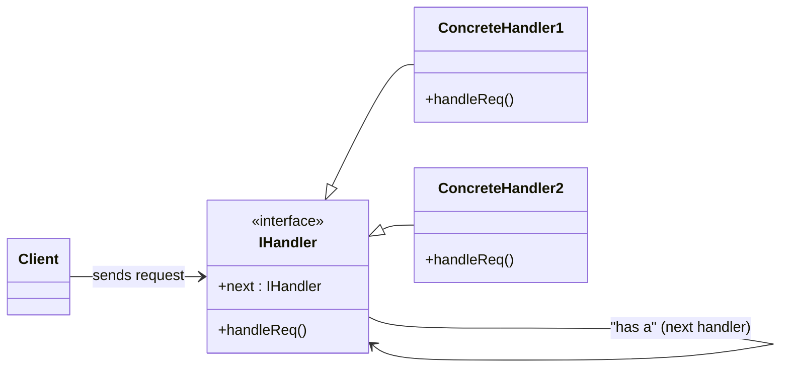

# 🔗 Chain of Responsibility Design Pattern (Behavioral)

## 📖 Table of Contents

- [📌 Intent](#-intent)
- [📚 Real-World Analogies](#-real-world-analogies)
- [🧱 Structure](#-structure)
- [🧪 Java Example: ATM Money Dispenser](#-java-example-atm-money-dispenser)
- [🔧 Main Client Logic](#-main-client-logic)
- [⚙️ When to Use](#️-when-to-use)
- [✅ Advantages](#-advantages)
- [🚫 Disadvantages](#-disadvantages)
- [📈 UML Class Diagram (Mermaid)](#-uml-class-diagram-mermaid)
- [🧾 Summary for Interviews](#-summary-for-interviews)
- [🏁 Conclusion](#-conclusion)

## 📌 Intent

> Avoid coupling the sender of a request to its receiver by giving more than one object a chance to handle the request. Chain the receiving objects and pass the request along the chain until an object handles it.

---

## 📚 Real-World Analogies

- **ATM Machine**: Different denominations handle part of the withdrawal amount.
- **Leave Approval System**: Employee leave requests pass from Team Lead → Manager → HR.
- **Technical Support**: Level 1 → Level 2 → Level 3 escalation.

---

## 🧱 Structure

| Component           | Role                                                          |
| ------------------- | ------------------------------------------------------------- |
| **Handler**         | Abstract class/interface defining a method to handle requests |
| **ConcreteHandler** | Handles request or forwards it to next handler in the chain   |
| **Client**          | Sends the request to the first handler                        |

---

## 🧪 Java Example: ATM Money Dispenser

```java
abstract class MoneyHandler {
    protected MoneyHandler nextHandler;

    public void setNextHandler(MoneyHandler next) {
        this.nextHandler = next;
    }

    public abstract void dispense(int amount);
}
```

```java
class ThousandHandler extends MoneyHandler {
    private int numNotes;
    public ThousandHandler(int numNotes) {
        this.numNotes = numNotes;
    }
    public void dispense(int amount) {
        int notes = Math.min(amount / 1000, numNotes);
        numNotes -= notes;
        if (notes > 0) System.out.println("₹1000 x " + notes);
        int remainder = amount - (notes * 1000);
        if (remainder > 0 && nextHandler != null) nextHandler.dispense(remainder);
    }
}
```

Same structure applies to:

- `FiveHundredHandler`
- `TwoHundredHandler`
- `HundredHandler`

---

### 🔧 Main Client Logic

```java
public class ChainOfResponsibilityPattern {
    public static void main(String[] args) {
        MoneyHandler h1000 = new ThousandHandler(5);
        MoneyHandler h500 = new FiveHundredHandler(10);
        MoneyHandler h200 = new TwoHundredHandler(20);
        MoneyHandler h100 = new HundredHandler(50);

        h1000.setNextHandler(h500);
        h500.setNextHandler(h200);
        h200.setNextHandler(h100);

        int amount = 3700;
        System.out.println("Requesting: ₹" + amount);
        h1000.dispense(amount);
    }
}
```

---

## ⚙️ When to Use

| Use Case                            | Description                                  |
| ----------------------------------- | -------------------------------------------- |
| UI Event Handling                   | Key press → OS → App window → Control        |
| Logging System                      | Pass logs to error/file/console handlers     |
| Validation Chains                   | Form inputs pass through multiple validators |
| Authentication / Authorization Flow | Multiple layers check credentials            |

---

## ✅ Advantages

- Loose coupling between sender and receiver.
- Chain can grow/change without modifying client code.
- Responsibility is distributed, improving flexibility.

---

## 🚫 Disadvantages

- Request might go unhandled if no handler processes it.
- Debugging can be harder due to dynamic flow.
- Overuse can lead to long, hard-to-trace chains.

---

## 📈 UML Class Diagram (Mermaid)



---

## 🧾 Summary for Interviews

| Concept                | Explanation                                                 |
| ---------------------- | ----------------------------------------------------------- |
| **Pattern Type**       | Behavioral                                                  |
| **Core Idea**          | Chain handlers, pass request until someone handles it       |
| **Analogy**            | ATM, tech support escalation, logging system                |
| **Main Class Members** | Handler (abstract), ConcreteHandler, Client                 |
| **Key Benefit**        | Removes tight coupling between request sender and receiver  |
| **Common Pitfall**     | Chain may not end in a handler that can process the request |

---

## 🏁 Conclusion

Use **Chain of Responsibility** when:

- You want multiple objects to get a chance to handle a request.
- You want to dynamically configure responsibility.
- You want to simplify object responsibilities using delegation.

---
