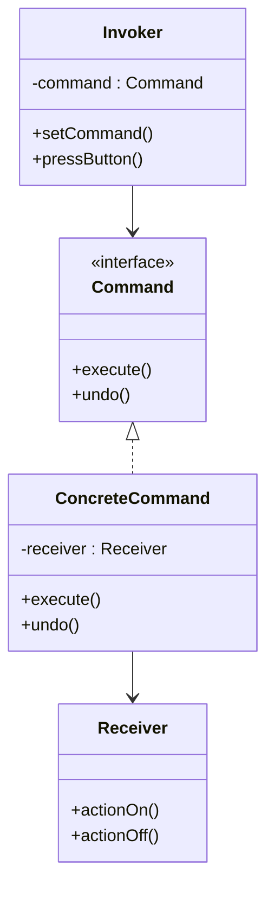

# 🧠 Command Design Pattern – Master Revision Guide

> The Command Pattern is a behavioral design pattern that encapsulates a request as an object, allowing users to parameterize clients with different requests, queue or log requests, and support undoable operations.

---

## 📘 What Is the Command Pattern?

The Command pattern turns a request into a standalone object that contains all the information about the request. This decouples the invoker of a request from the object that knows how to execute it.

### ✅ Advantages:

- Supports **undo/redo**
- Allows **queueing or scheduling**
- Enables **logging of commands**
- Promotes **loose coupling** between sender and receiver

---

## 🧱 Structure

### Participants:

| Component         | Description                                   |
| ----------------- | --------------------------------------------- |
| `Command`         | Interface with `execute()` and `undo()`       |
| `ConcreteCommand` | Binds a receiver to an action                 |
| `Receiver`        | The actual object that performs the action    |
| `Invoker`         | Holds and invokes commands                    |
| `Client`          | Creates commands and assigns them to invokers |

---

## 💡 Real-World Analogy

Imagine a **TV Remote**:

- The **Remote** is the **Invoker**
- **TV** is the **Receiver**
- The **PowerButtonCommand** tells the TV to turn on/off
- You can **dynamically assign** commands to different buttons

---

## 💻 Java Example (Full Code)

```java
interface Command {
    void execute();
    void undo();
}

class Light {
    void turnOn() { System.out.println("Light ON"); }
    void turnOff() { System.out.println("Light OFF"); }
}

class LightCommand implements Command {
    private Light light;
    public LightCommand(Light light) { this.light = light; }
    public void execute() { light.turnOn(); }
    public void undo() { light.turnOff(); }
}

class RemoteController {
    private List<Command> buttons = new ArrayList<>();
    private List<Boolean> buttonStates = new ArrayList<>();

    public RemoteController(int numButtons) {
        for (int i = 0; i < numButtons; i++) {
            buttons.add(null);
            buttonStates.add(false);
        }
    }

    public void setCommand(int index, Command cmd) {
        if (index >= 0 && index < buttons.size()) {
            buttons.set(index, cmd);
            buttonStates.set(index, false);
        }
    }

    public void pressButton(int index) {
        if (index >= 0 && index < buttons.size() && buttons.get(index) != null) {
            if (!buttonStates.get(index)) {
                buttons.get(index).execute();
            } else {
                buttons.get(index).undo();
            }
            buttonStates.set(index, !buttonStates.get(index));
        } else {
            System.out.println("Invalid or unassigned button.");
        }
    }
}
```

---

## 📦 Use Cases

| Scenario             | Description                       |
| -------------------- | --------------------------------- |
| GUI Button Events    | Each button triggers a command    |
| Undo/Redo in Editors | Maintain history of actions       |
| Home Automation      | Assign/remove commands at runtime |
| Macro Recording      | Queue multiple commands           |
| Game Input Mapping   | Map keys to commands dynamically  |
| Job Scheduling       | Delay execution of tasks          |

---

## ❓ Common Doubts (with Answers)

### Q: Why not directly call `receiver.method()`?

A: Direct calls tightly couple the client and receiver. You lose flexibility for undoing, queuing, or logging.

---

### Q: Why use separate `ConcreteCommand` classes?

A: To keep behavior encapsulated, allow reuse, and support extensibility without changing core logic.

---

### Q: Can I use a general `Appliance` class with `on()`/`off()`?

A: Yes, but you lose specific behavior like fan speed or brightness. Favor composition over inheritance where needed.

---

### Q: Can commands target multiple receivers?

A: Yes! Create composite or macro commands to handle multiple receivers at once.

---

## 📌 Summary (Cheat Sheet)

- **Command** – Declares `execute()` / `undo()`
- **ConcreteCommand** – Knows which receiver to call
- **Receiver** – Knows how to do the work
- **Invoker** – Holds and triggers the command
- **Client** – Ties everything together

---

## 🔰 UML Diagram


### 🔁 Summary of Flow

1. **Client** creates a `ConcreteCommand`, passing the `Receiver` to it.
2. **Client** assigns the command to the **Invoker**.
3. **Invoker** calls `execute()` on the command.
4. `ConcreteCommand` delegates the call to the `Receiver`.

---

## 🧠 Real-World Analogy

**TV Remote Example:**

- **Invoker**: The remote control
- **Command**: Interface like `execute()` and `undo()`
- **ConcreteCommand**: `PowerOnCommand`, `VolumeUpCommand`
- **Receiver**: The TV that knows how to perform the action

This setup allows you to swap actions at runtime without changing the remote's logic.

---
