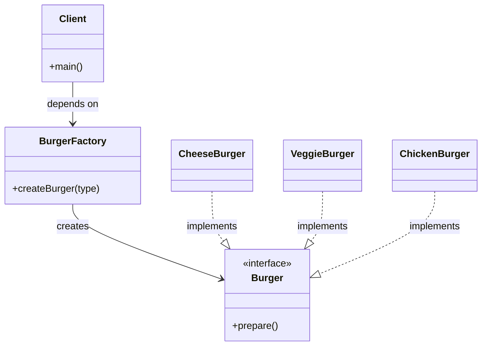
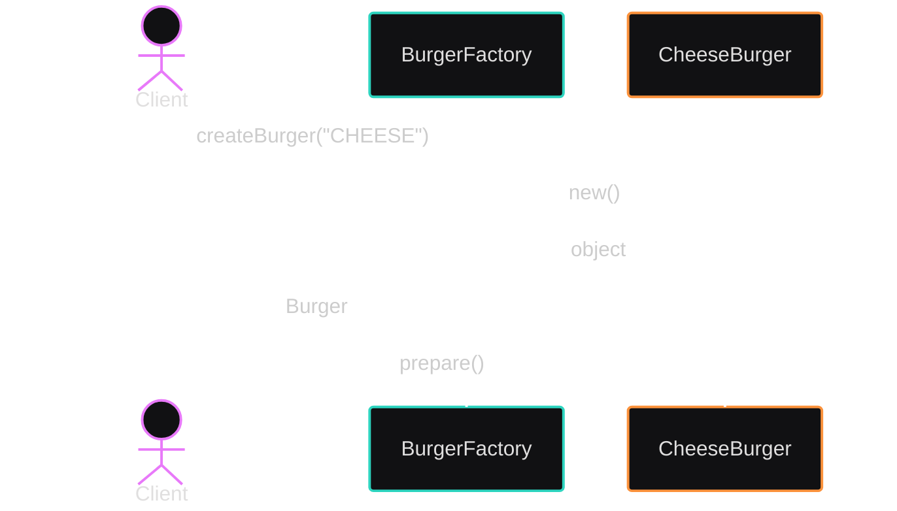
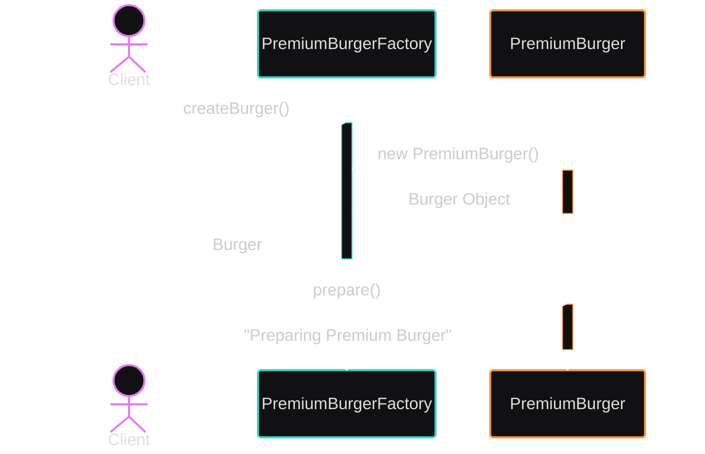
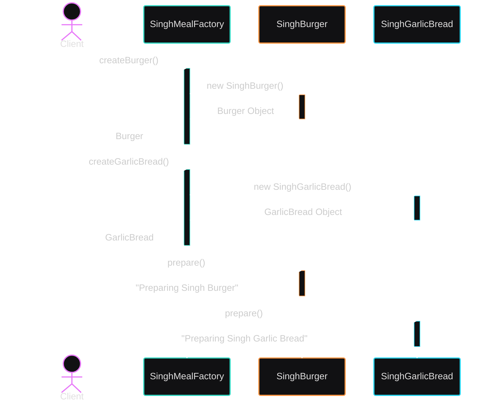

# 🍔 Factory Design Patterns in Java

The Factory Method Design Pattern is a Creational Design Pattern that defines an interface (or abstract method) for creating objects, but allows subclasses to decide which concrete class to instantiate.

Instead of creating objects directly using new, object creation is delegated to specialized factory subclasses, promoting loose coupling, extensibility, and polymorphism.

This improves:

- flexibility
- maintainability
- scalability
- loose coupling
- testability

# 📖 Standard GoF Definition

According to Design Patterns: Elements of Reusable Object-Oriented Software:

> “Define an interface for creating an object, but let subclasses decide which class to instantiate. Factory Method lets a class defer instantiation to subclasses.”

# 🧠 Why Factory Patterns Exist

Imagine an application directly creating objects everywhere:

```java
Burger burger = new CheeseBurger();
```

Initially everything looks fine.

But later requirements grow:

- add VeggieBurger
- add ChickenBurger
- add PremiumBurger
- add WheatBurger
- add VeganBurger

Now object creation logic spreads everywhere.

This causes:

- tight coupling
- repeated creation logic
- violation of Open Closed Principle
- difficult maintenance
- hard testing

Factory patterns solve this problem by separating:

```text
Object Creation
```

from:

```text
Object Usage
```

# 🏗️ Types of Factory Patterns

| Pattern          | Main Idea                                 |
| ---------------- | ----------------------------------------- |
| Simple Factory   | One centralized class creates all objects |
| Factory Method   | Subclasses decide which object to create  |
| Abstract Factory | Creates families of related objects       |

# 🌀 Relationship Between Factory Patterns

# 1️⃣ Simple Factory Pattern

## 🧠 Core Idea

One centralized factory creates all products.

Client provides some input:

```text
"CHEESE"
```

Factory decides:

```text
Which concrete object to create
```

## 🚨 Real Problem

Imagine building a burger ordering application.

Initially:

```java
Burger burger = new CheeseBurger();
```

works fine.

But later:

- Veggie Burger added
- Chicken Burger added
- Vegan Burger added

Now everywhere in application:

```java
if(type.equals("CHEESE")) {
    return new CheeseBurger();
}
else if(type.equals("VEGGIE")) {
    return new VeggieBurger();
}
```

This logic spreads everywhere.

## ✅ Solution — Centralize Creation Logic

### Step 1 — Product Interface

```java
interface Burger {

    void prepare();
}
```

### Step 2 — Concrete Products

#### Cheese Burger

```java
class CheeseBurger implements Burger {

    @Override
    public void prepare() {
        System.out.println("Preparing Cheese Burger");
    }
}
```

#### Veggie Burger

```java
class VeggieBurger implements Burger {

    @Override
    public void prepare() {
        System.out.println("Preparing Veggie Burger");
    }
}
```

#### Chicken Burger

```java
class ChickenBurger implements Burger {

    @Override
    public void prepare() {
        System.out.println("Preparing Chicken Burger");
    }
}
```

### Step 3 — Simple Factory

```java
class BurgerFactory {

    public static Burger createBurger(String type) {

        if(type.equalsIgnoreCase("CHEESE")) {
            return new CheeseBurger();
        }

        if(type.equalsIgnoreCase("VEGGIE")) {
            return new VeggieBurger();
        }

        if(type.equalsIgnoreCase("CHICKEN")) {
            return new ChickenBurger();
        }

        return null;
    }
}
```

### Step 4 — Client

```java
public class Main {

    public static void main(String[] args) {

        Burger burger = BurgerFactory.createBurger("CHEESE");

        burger.prepare();
    }
}
```

## 📊 UML Diagram — Simple Factory



## 🔄 Sequence Diagram — Simple Factory



## ⚠️ Biggest Limitation

Adding a new burger requires modifying factory itself.

```java
else if(type.equals("VEGAN")) {
    return new VeganBurger();
}
```

This violates:

```text
Open Closed Principle
```

because existing code must change again and again.

## 🎯 Use Case

Use Simple Factory when:

- application is small
- object creation is simple
- centralized creation logic needed
- extensibility is not major concern

# 2️⃣ Factory Method Pattern

## 🧠 Core Idea

Instead of one giant factory:

✅ Create separate factories

✅ Subclasses decide object creation

This pattern uses:

```text
Inheritance + Polymorphism
```

## 🚨 Problem With Simple Factory

Over time this becomes huge:

```java
if(type.equals("CHEESE"))
else if(type.equals("VEGGIE"))
else if(type.equals("CHICKEN"))
else if(type.equals("VEGAN"))
```

Now one class handles everything.

Factory Method decentralizes creation responsibility.

## ✅ Solution — Decentralize Creation Logic

Think about food delivery platforms.

Simple Factory:

```text
One giant kitchen makes all foods
```

Factory Method:

```text
Each restaurant prepares its own food
```

Burger Shop knows burgers.

Pizza Shop knows pizza.

Sushi Shop knows sushi.

## 🧱 Components of Factory Method

| Component        | Responsibility           |
| ---------------- | ------------------------ |
| Product          | Common interface         |
| Concrete Product | Actual implementation    |
| Creator          | Declares factory method  |
| Concrete Creator | Creates specific product |

## 🎭 Roles Explained (Factory Method)

1. `Product` (e.g., `Burger`)
   The interface or abstract class that defines the contract for all objects the factory method creates. Client code depends only on this interface, not on concrete types.

> In our burger example, this is the `Burger` interface with its `prepare()` method.

2. `ConcreteProduct` (e.g., `BasicBurger`)
   The concrete classes that implement the Product interface. Each one provides its own behavior while keeping the same method signature.

> `BasicBurger`, `StandardBurger`, and `PremiumBurger` all implement Burger but prepare themselves differently.

3. `Creator` (e.g., `BurgerFactory`)
   An interface or abstract class that declares the factory method (`createBurger()`) and may contain shared logic that uses the product.

> The `Creator` defines the workflow. Subclasses decide which concrete product to return.

4. `ConcreteCreator` (e.g., `PremiumBurgerFactory`)
   Concrete classes that override the factory method to return a specific `ConcreteProduct`.

> `PremiumBurgerFactory` returns new `PremiumBurger()`, while `StandardBurgerFactory` returns new `StandardBurger()`.

## 🧩 Step-by-Step Implementation

### Step 1 — Product Interface

```java
interface Burger {

    void prepare();
}
```

### Step 2 — Concrete Products

#### Basic Burger

```java
class BasicBurger implements Burger {

    @Override
    public void prepare() {
        System.out.println("Preparing Basic Burger");
    }
}
```

#### Standard Burger

```java
class StandardBurger implements Burger {

    @Override
    public void prepare() {
        System.out.println("Preparing Standard Burger");
    }
}
```

#### Premium Burger

```java
class PremiumBurger implements Burger {

    @Override
    public void prepare() {
        System.out.println("Preparing Premium Burger");
    }
}
```

### Step 3 — Creator Interface

```java
interface BurgerFactory {

    Burger createBurger();
}
```

### Step 4 — Concrete Creators

#### Basic Burger Factory

```java
class BasicBurgerFactory implements BurgerFactory {

    @Override
    public Burger createBurger() {
        return new BasicBurger();
    }
}
```

#### Standard Burger Factory

```java
class StandardBurgerFactory implements BurgerFactory {

    @Override
    public Burger createBurger() {
        return new StandardBurger();
    }
}
```

#### Premium Burger Factory

```java
class PremiumBurgerFactory implements BurgerFactory {

    @Override
    public Burger createBurger() {
        return new PremiumBurger();
    }
}
```

### Step 5 — Client

```java
public class Main {

    public static void main(String[] args) {

        BurgerFactory factory = new PremiumBurgerFactory();

        Burger burger = factory.createBurger();

        burger.prepare();
    }
}
```

## 📊 UML Diagram — Factory Method

<!-- [[factory_method_class_diagram]]  -->


## 🔄 Sequence Diagram — Factory Method



## 🧠 Most Important Understanding

Factory Method delegates creation responsibility to subclasses.

This achieves:

```text
Open Closed Principle
```

because new creators can be added WITHOUT modifying old code.

## 🎯 Use Case

Use Factory Method when:

- object creation varies
- subclasses decide creation
- runtime extensibility needed
- heavy polymorphism involved

# 3️⃣ Abstract Factory Pattern

## 🧠 Core Idea

Factory Method creates:

```text
One Product
```

Abstract Factory creates:

```text
Families of Related Products
```

It is often called:

```text
Factory of Factories
```

## 🚨 Real Problem

Suppose restaurant meal combos must remain compatible.

Example:

| Restaurant  | Burger         | Garlic Bread  |
| ----------- | -------------- | ------------- |
| SinghBurger | Wheat Burger   | Wheat Bread   |
| KingBurger  | Regular Burger | Regular Bread |

You must ensure related products are created together.

## ✅ Solution — Create Product Families

## 🎭 Roles Explained (Abstract Factory)

1. `AbstractProduct` (e.g., `Burger`, `GarlicBread`)
   Interfaces or abstract classes that define the contract for each product family. Client code depends on these, not on concrete products.

2. `ConcreteProduct` (e.g., `SinghBurger`, `KingGarlicBread`)
   Concrete implementations of the abstract products. Each family provides matching variants.

3. `AbstractFactory` (e.g., `MealFactory`)
   An interface or abstract class that declares creation methods for each product family (`createBurger()`, `createGarlicBread(`)).

4. `ConcreteFactory` (e.g., `SinghMealFactory`)
   Concrete factories that create related products that belong together.

`SinghMealFactory` produces `SinghBurger` and `SinghGarlicBread`, ensuring the variants are compatible.

## 🧩 Product Families Implementation

### Product Family 1 — Burger

```java
interface Burger {

    void prepare();
}
```

#### Singh Burger

```java
class SinghBurger implements Burger {

    @Override
    public void prepare() {
        System.out.println("Preparing Singh Burger");
    }
}
```

#### King Burger

```java
class KingBurger implements Burger {

    @Override
    public void prepare() {
        System.out.println("Preparing King Burger");
    }
}
```

### Product Family 2 — Garlic Bread

```java
interface GarlicBread {

    void prepare();
}
```

#### Singh Garlic Bread

```java
class SinghGarlicBread implements GarlicBread {

    @Override
    public void prepare() {
        System.out.println("Preparing Singh Garlic Bread");
    }
}
```

#### King Garlic Bread

```java
class KingGarlicBread implements GarlicBread {

    @Override
    public void prepare() {
        System.out.println("Preparing King Garlic Bread");
    }
}
```

## 🏭 Abstract Factory

```java
interface MealFactory {

    Burger createBurger();

    GarlicBread createGarlicBread();
}
```

## 🏭 Concrete Factories

### Singh Meal Factory

```java
class SinghMealFactory implements MealFactory {

    @Override
    public Burger createBurger() {
        return new SinghBurger();
    }

    @Override
    public GarlicBread createGarlicBread() {
        return new SinghGarlicBread();
    }
}
```

### King Meal Factory

```java
class KingMealFactory implements MealFactory {

    @Override
    public Burger createBurger() {
        return new KingBurger();
    }

    @Override
    public GarlicBread createGarlicBread() {
        return new KingGarlicBread();
    }
}
```

## 👨‍💻 Client

```java
public class Main {

    public static void main(String[] args) {

        MealFactory factory = new SinghMealFactory();

        Burger burger = factory.createBurger();

        GarlicBread bread = factory.createGarlicBread();

        burger.prepare();

        bread.prepare();
    }
}
```

# 📊 UML Diagram — Abstract Factory

<!-- [[abstract_factory_method_uml_diagram]] -->


# 🔄 Sequence Diagram — Abstract Factory



## ⚖️ Comparison Table

## 🎯 Use Case

Use Abstract Factory when:

- multiple related products must stay compatible
- you need to swap entire families at runtime
- a consistent product style must be enforced

| Feature                    | Simple Factory        | Factory Method           | Abstract Factory             |
| -------------------------- | --------------------- | ------------------------ | ---------------------------- |
| Responsibility of Creation | One class             | Subclasses               | Concrete Factories           |
| Open for Extension?        | ❌ No                 | ✅ Yes                   | ✅ Yes                       |
| Supports Polymorphism      | ❌ No                 | ✅ Yes                   | ✅ Yes                       |
| Multiple Product Families  | ❌ No                 | ❌ No                    | ✅ Yes                       |
| Design Pattern Type        | Custom / Non GoF      | GoF (Creational)         | GoF (Creational)             |
| Ideal Use Case             | One centralized logic | Varying product creation | Families of related products |

## 📚 Real-World Analogies

- **Simple Factory**: Vending machine — choose an item, it gives it to you.
- **Factory Method**: Different stores (outlets) make burgers their own way.
- **Abstract Factory**: A meal combo — factory ensures all items (burger + side) match in style (wheat/regular).

## ✅ When to Use Which?

| Scenario                                              | Pattern to Use   |
| ----------------------------------------------------- | ---------------- |
| You want one method to create objects                 | Simple Factory   |
| You want different classes to decide instantiation    | Factory Method   |
| You want consistent product families (UI kits, meals) | Abstract Factory |

## 🎯 One-Line Interview Definition

> “Factory Method is a creational design pattern where object creation is delegated to subclasses through a common factory interface, allowing new object types to be introduced without modifying existing client code.”

## 🧠 Key Takeaways

- Avoid `new` in client code; use factories for object creation.
- Improves **loose coupling** and adheres to **Open/Closed Principle**.
- Always choose the pattern based on **scalability and flexibility needs**.
