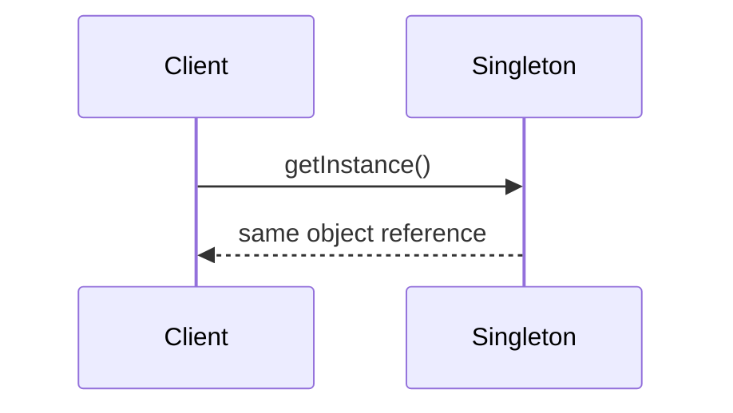
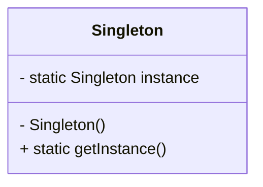
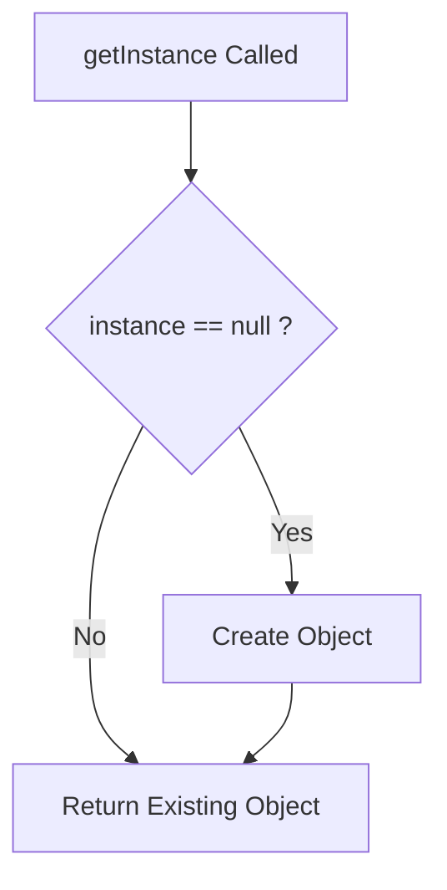
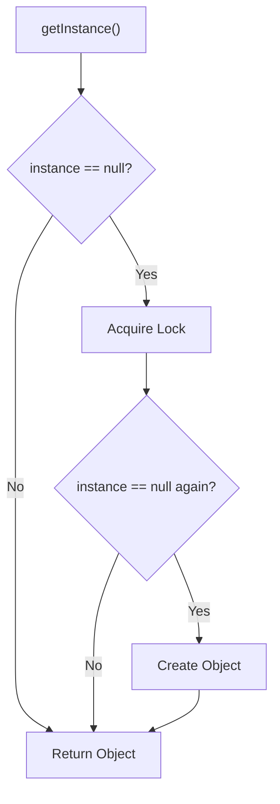

# 🔒 Singleton Design Pattern in Java

The Singleton Pattern ensures a class has **only one instance** and provides a **global point of access** to it.

## 🌀 What is the Singleton Pattern?

> The Singleton Design Pattern is a **creational pattern** that restricts the instantiation of a class to one single object. Singleton Pattern ensures that a class has **only one instance** and provides a global point of access to it.

## 🚀 The Real Problem

Imagine you are building:

- A database connection manager
- Logger service
- Cache manager
- Configuration loader
- Thread pool manager

Now ask yourself:

> ❓ “Should multiple objects of these classes exist?”

Usually:

```text
NO
```

Why?

Because multiple instances can create:

- inconsistent state
- duplicate resources
- memory waste
- synchronization issues
- database connection explosion

## 💥 Example Problem Without Singleton

### ❌ Logger Example

```java
class Logger {
    public Logger() {
        System.out.println("Logger Created");
    }
}
```

```java
Logger l1 = new Logger();
Logger l2 = new Logger();
Logger l3 = new Logger();
```

### Output

```text
Logger Created
Logger Created
Logger Created
```

## 🚨 Why This Is Bad

Now imagine:

- each logger opens a file
- each DB manager creates a connection
- each cache manager stores separate cache

👉 Huge resource waste.

## 🔥 What Singleton Solves

Singleton ensures:

- **Single Instance**: Only one instance is ever created.
- **Global Access Point**: Provides a static method for accessing that instance.
- **Thread-Safe**: In multithreaded environments, care must be taken to ensure only one instance is created.

## 🧠 Core Idea

Instead of allowing:

```java
new Singleton();
```

from outside,

the class controls its own object creation.

## 🧩 How to Implement Singleton in Java?

## 1️⃣ Eager Initialization Singleton

```java
class Singleton {

    // single object created immediately
    private static final Singleton instance = new Singleton();

    // private constructor
    private Singleton() {}

    // global access method
    public static Singleton getInstance() {
        return instance;
    }
}
```

### 🧠 Understanding Step-by-Step

### 🔒 1. Private Constructor

```java
private Singleton() {}
```

Prevents:

```java
new Singleton();
```

from outside.

### 📍 2. Static Instance Variable

```java
private static final Singleton instance
```

Why static?

Because:

```text
Singleton belongs to class, not object
```

Only one copy exists in memory.

### 📍 3. Global Access Method

```java
public static Singleton getInstance()
```

Provides controlled access.

### 📊 Object Flow



### 📈 Class Diagram



### 🔥 Important Property

```java
Singleton s1 = Singleton.getInstance();
Singleton s2 = Singleton.getInstance();
```

### 🟢 Both Point to SAME Object

```java
System.out.println(s1 == s2);
```

Output:

```text
true
```

### 🧠 Why Constructor Must Be Private

If constructor is public:

```java
Singleton s1 = new Singleton();
Singleton s2 = new Singleton();
```

💥 Singleton completely breaks.

## 2️⃣ Lazy Initialization Singleton (Non-thread-safe ❌)

### 🚀 Problem with Eager Initialization

Object created even if never used.

### ✅ Lazy Version

Object created ONLY when needed.

```java
class Singleton {

    private static Singleton instance;

    private Singleton() {}

    public static Singleton getInstance() {

        if(instance == null) {
            instance = new Singleton();
        }

        return instance;
    }
}
```

### 📊 Lazy Initialization Flow



### 🚨 Major Problem — Multithreading

Suppose two threads execute:

```java
if(instance == null)
```

at SAME time.

Both may create objects.

### 💥 Singleton Breaks

```text
Thread 1 -> creates object
Thread 2 -> creates another object
```

Now two instances exist.

## 3️⃣ Thread-Safe Singleton (Synchronized Method)

### ✅ Synchronized Method

```java
class Singleton {

    private static Singleton instance;

    private Singleton() {}

    public static synchronized Singleton getInstance() {

        if(instance == null) {
            instance = new Singleton();
        }

        return instance;
    }
}
```

### 🚨 Problem Here

Every call becomes synchronized.

Even after object creation.

👉 Performance overhead.

## 4️⃣ Double-Checked Locking Singleton

### ✅ Optimized Thread Safe Singleton

```java
class Singleton {

    private static volatile Singleton instance;

    private Singleton() {}

    public static Singleton getInstance() {

        if(instance == null) {

            synchronized (Singleton.class) {

                if(instance == null) {
                    instance = new Singleton();
                }
            }
        }

        return instance;
    }
}
```

### 🧠 Why Double Check?

First check:

```java
if(instance == null)
```

avoids unnecessary locking.

Second check inside synchronized:

prevents race condition.

### 🔥 Why volatile Is Important

```java
private static volatile Singleton instance;
```

Prevents:

```text
instruction reordering
```

Without volatile:

another thread may see partially created object.

### 📊 Double Checked Locking Flow



## 5️⃣ Singleton using Enum ✅🔥

### 🏆 Enum Singleton(Best Singleton in Java)

```java
enum Singleton {
    INSTANCE;

    public void show() {
        System.out.println("Singleton Working");
    }
}
```

Usage:

```java
Singleton.INSTANCE.show();
```

### 🔥 Why Enum Singleton Is Best

It automatically protects against:

- reflection attacks
- serialization issues
- multiple instantiation

## ⚠️ Common Singleton Problems

### ❌ Reflection Attack

Reflection can access private constructor.

```java
constructor.setAccessible(true);
```

and create another object.

### ❌ Serialization Problem

After deserialization:

new object may be created.

### ❌ Cloning Problem

`clone()` can create duplicate instance.

## ✅ Fix Serialization Issue

```java
protected Object readResolve() {
    return instance;
}
```

## 📦 Real World Examples

| System                   | Why Singleton         |
| ------------------------ | --------------------- |
| Logger                   | Single logging system |
| Database Connection Pool | Shared resource       |
| Cache Manager            | Centralized cache     |
| Configuration Manager    | Single config source  |
| Thread Pool              | Shared threads        |

## 🧠 OOP Concepts Used

| OOP Concept              | Usage              |
| ------------------------ | ------------------ |
| Encapsulation            | constructor hidden |
| Static Members           | global access      |
| Controlled Instantiation | only one object    |
| Lazy Loading             | object on demand   |

## ⚠️ When NOT To Use Singleton

Singleton becomes dangerous when:

- too much global state
- hidden dependencies
- hard-to-test code
- tight coupling

## 🚨 Interview Trap

Many developers misuse Singleton as:

```text
global variable replacement
```

That creates bad architecture.

## 📊 Singleton vs Static Class

| Feature              | Singleton | Static Class |
| -------------------- | --------- | ------------ |
| Object Exists        | ✅ Yes    | ❌ No        |
| Supports Interfaces  | ✅ Yes    | ❌ No        |
| Supports Inheritance | ✅ Yes    | ❌ No        |
| Lazy Loading         | ✅ Yes    | ❌ No        |
| Polymorphism         | ✅ Yes    | ❌ No        |

## 🎯 Best Interview Answer

> “Singleton Design Pattern ensures that only one instance of a class exists throughout the application and provides a global access point to it. It is commonly used for shared resources like loggers, configuration managers, caches, and database connection managers.”

## 🧪 Complete Java Example

```java
class Singleton {

    private static volatile Singleton instance;

    private Singleton() {
        System.out.println("Singleton Created");
    }

    public static Singleton getInstance() {

        if(instance == null) {

            synchronized (Singleton.class) {

                if(instance == null) {
                    instance = new Singleton();
                }
            }
        }

        return instance;
    }

    public void showMessage() {
        System.out.println("Hello Singleton");
    }
}

public class Main {

    public static void main(String[] args) {

        Singleton s1 = Singleton.getInstance();
        Singleton s2 = Singleton.getInstance();

        s1.showMessage();

        System.out.println(s1 == s2);
    }
}
```

## ⚠️ Pitfalls to Avoid

| Mistake                            | Problem                                                |
| ---------------------------------- | ------------------------------------------------------ |
| Not making the constructor private | Multiple instances can be created                      |
| Missing thread safety              | Leads to inconsistent state in multithreaded apps      |
| Forgetting serialization logic     | `readResolve()` is needed if not using enum            |
| Using too many singletons          | Becomes a disguised global variable (bad design smell) |
