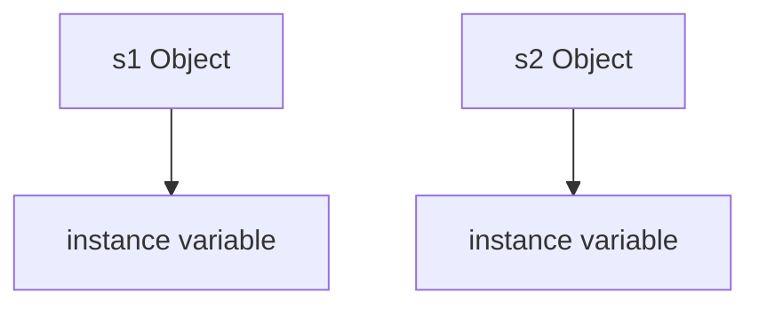
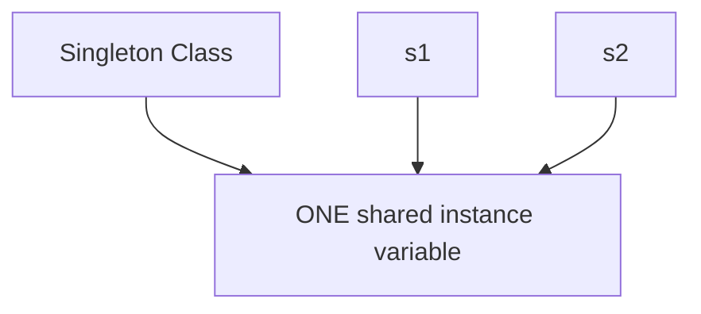
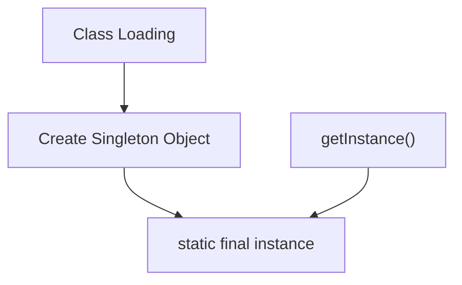
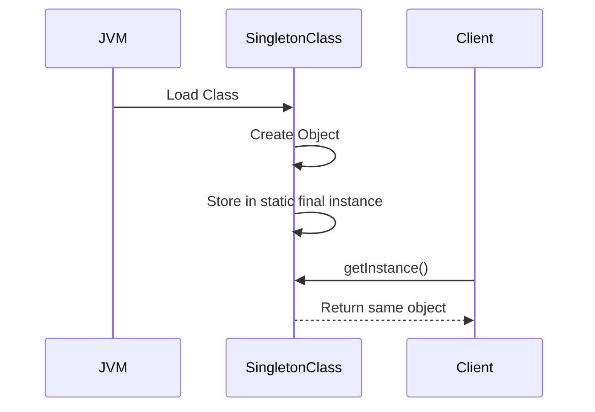

# 🌀 Understanding `static` & `final` in Java for Singleton

## 📦 What Does `static` Mean?

### 🧠 Core Idea

```text
static = belongs to the class itself
```

NOT to individual objects.

### ❌ Normal Instance Variable

```java
class Test {
    int x = 10;
}
```

Every object gets its own copy.

```java
Test t1 = new Test();
Test t2 = new Test();
```

Memory:

```text
t1.x -> 10
t2.x -> 10
```

### ✅ Static Variable

```java
class Test {
    static int x = 10;
}
```

Now only ONE shared copy exists.

### 🔥 Accessing Static Variable

```java
Test.x
```

instead of:

```java
t1.x
```

## 📦 What Does `final` Mean?

### 🧠 Core Idea

```text
final = cannot be reassigned after assignment
```

### ✅ Example

```java
final int x = 10;

x = 20; // ❌ ERROR
```

### 📍 Final Reference Variable

```java
final Test t = new Test();
```

means:

```text
t cannot point to another object
```

BUT object data may still change.

## 📦 What Does `static final` Mean?

```java
static final
```

means:

```text
ONE shared value
+
reference cannot change
```

### ✅ Example

```java
class Test {

    static final int VALUE = 100;
}
```

Properties:

- one shared copy
- cannot be modified

## 🔥 Why `static` Is Used in Singleton

### ✅ Singleton Example

```java
class Singleton {

    private static Singleton instance;
}
```

### 🧠 Reason

Singleton object must belong to:

```text
the class itself
```

NOT to objects.

### ❌ Without `static`

```java
class Singleton {

    private Singleton instance;
}
```

Every object gets its own instance variable.

💥 Singleton breaks.

### 📊 Without Static



### ✅ With Static



## 🔥 Why `final` Is Used in Singleton

Usually used in Eager Singleton:

```java
private static final Singleton instance =
        new Singleton();
```

### 🧠 Reason

We never want the reference to change after creation.

### ❌ Dangerous Without `final`

```java
instance = new Singleton();
```

Someone may accidentally reassign it.

### ✅ With `final`

```java
private static final Singleton instance;
```

Java guarantees:

```text
reference cannot point to another object
```

## 📦 Eager Singleton Flow



## 🧠 Why `static final` Together Is Powerful

| Keyword  | Purpose                 |
| -------- | ----------------------- |
| `static` | one shared reference    |
| `final`  | reference never changes |

Together:

```text
One permanent globally shared object reference
```

## 🚀 Full Singleton Example

```java
class Singleton {

    private static final Singleton instance =
            new Singleton();

    private Singleton() {}

    public static Singleton getInstance() {
        return instance;
    }
}
```

## 📍 What Happens Internally

When class loads:

```text
1. static variable created
2. Singleton object created
3. reference stored in instance
```

After that:

```java
Singleton.getInstance()
```

always returns the SAME object.

## 📊 Runtime Flow



## ⚠️ Important Interview Insight

### `final` Does NOT Make Object Immutable

```java
final List list = new ArrayList();
```

means:

```text
reference cannot change
```

BUT:

```java
list.add(10);
```

still works.

## ❌ Wrong Thinking

```text
final object = object cannot change
```

## ✅ Correct Thinking

```text
final reference = reference cannot point elsewhere
```

## 🚀 Why Lazy Singleton Usually Cannot Use `final`

### ❌ Invalid

```java
private static final Singleton instance;

instance = new Singleton();
```

because final variables must be initialized exactly once immediately.

### ✅ Lazy Singleton Uses

```java
private static volatile Singleton instance;
```

## 📊 Eager vs Lazy Singleton

| Type            | static | final | volatile |
| --------------- | ------ | ----- | -------- |
| Eager Singleton | ✅     | ✅    | ❌       |
| Lazy Singleton  | ✅     | ❌    | ✅       |

## 🎯 Interview Answer

> `static` ensures only one shared instance variable exists at the class level, while `final` ensures that the reference cannot be reassigned after initialization. Together, `static final` helps maintain a single permanent shared object in eager Singleton implementation.
