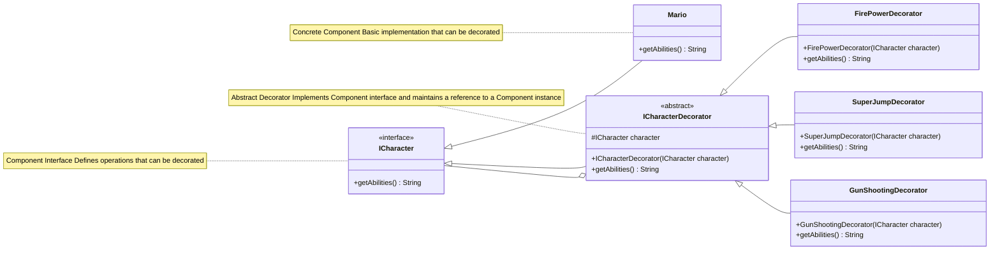

# 🎭 Decorator Design Pattern - Easy Revision Guide

> The Decorator Design Pattern lets you **add new features to objects** at runtime **without changing their original code**. It wraps the original object with a layer of new behavior.

---

## 📋 Table of Contents

* [What Is It?](#-what-is-it)
* [Key Parts](#-key-parts)
* [UML Diagram](#-uml-diagram)
* [Mario Example](#-mario-example)
* [How It Runs](#-how-it-runs)
* [Why Use Interface Type](#-why-use-interface-type)
* [Real-Life Uses](#-real-life-uses)
* [Pros and Cons](#-pros-and-cons)
* [Similar Patterns](#-similar-patterns)
* [Quick Revision](#-quick-revision)
* [Why Use Interface Instead of Class?](#-why-do-we-use-icharacter-mario--new-mario-instead-of-mario-mario--new-mario)

---

## 🎯 What Is It?

Decorator is a **structural design pattern**. It allows you to **add extra features** to objects by wrapping them in a decorator class.

### 🎮 Mario Analogy

> * Start with basic Mario
> * Add fire power 🧯
> * Add super jump 🕴️
> * Add gun shooting 🔫
>
> Every new power is added without changing the Mario class.

---

## 🧱 Key Parts

| Component              | Role                                    |
| ---------------------- | --------------------------------------- |
| `ICharacter`           | Interface for characters                |
| `Mario`                | Real Mario (base class)                 |
| `ICharacterDecorator`  | Abstract class that wraps any character |
| `FirePowerDecorator`   | Adds fire ability                       |
| `SuperJumpDecorator`   | Adds jumping ability                    |
| `GunShootingDecorator` | Adds gun shooting                       |

---

## 📊 UML Diagram



---

## 🎮 Mario Example

### Interface

```java
interface ICharacter {
   String getAbilities();
}
```

### Base Mario

```java
class Mario implements ICharacter {
   public String getAbilities() {
       return "Basic Mario";
   }
}
```

### Abstract Decorator

```java
abstract class ICharacterDecorator implements ICharacter {
   protected ICharacter character;
   public ICharacterDecorator(ICharacter character) {
       this.character = character;
   }
}
```

### Fire Power

```java
class FirePowerDecorator extends ICharacterDecorator {
   public FirePowerDecorator(ICharacter character) {
       super(character);
   }
   public String getAbilities() {
       return character.getAbilities() + ", Fire Power";
   }
}
```

Same for `SuperJumpDecorator`, `GunShootingDecorator`.

---

## 🔄 Execution Flow

```
DecoratorDesignPattern.main()
├── Create basic Mario
│   └── mario.getAbilities() -> "Basic Mario"
│
├── Decorate with FirePowerDecorator
│   └── mario.getAbilities() -> "Basic Mario, Fire Power"
│
├── Decorate with SuperJumpDecorator
│   └── mario.getAbilities() -> "Basic Mario, Fire Power, Super Jump"
│
└── Decorate with GunShootingDecorator
    └── mario.getAbilities() -> "Basic Mario, Fire Power, Super Jump, Gun Shooting"
```

Output:

```
Abilities: Basic Mario
Abilities after Fire Power: Basic Mario, Fire Power
Abilities after Super Jump: Basic Mario, Fire Power, Super Jump
Abilities after Gun Shooting: Basic Mario, Fire Power, Super Jump, Gun Shooting
```

---

## 🔍 Why Use Interface Type?

```java
// Recommended:
ICharacter mario = new Mario();
mario = new FirePowerDecorator(mario);

// ❌ Not recommended:
Mario mario = new Mario();
mario = new FirePowerDecorator(mario); // Error
```

### ✅ Interface Type Benefits:

* Supports decorators (polymorphism)
* Easy to replace and stack layers
* Follows best OOP practices

---

## 🌍 Real-Life Uses

| Use Case      | Example                                   |
| ------------- | ----------------------------------------- |
| File I/O      | BufferedInputStream wraps FileInputStream |
| UI            | ScrollablePanel adds scroll to panel      |
| Games         | Add weapons/powers to players             |
| Coffee Orders | Add milk, sugar, etc.                     |
| Web APIs      | Add logging/authentication                |

---

## ✅ Pros and Cons

### ✅ Pros

* Add features without touching base class
* Stack decorators as needed
* Follows **Open/Closed Principle**

### ❌ Cons

* Many small classes
* Order matters
* Removing decorators is tricky

---

## 🔄 Similar Patterns

| Pattern                 | Difference                                    |
| ----------------------- | --------------------------------------------- |
| Adapter                 | Changes interface                             |
| Composite               | Manages whole-part tree, not behavior         |
| Strategy                | Changes logic/algorithm, not wrapper behavior |
| Chain of Responsibility | Passes request along chain, not wraps         |

---

## 📝 Quick Revision

* Decorator adds features **at runtime**, not via subclass
* Always program to interface: `ICharacter`, not `Mario`
* Wrap objects in decorators: each adds something extra
* Java I/O is full of decorators!
* Use when subclassing is too rigid

> 💡 Tip: Decorator = Wrapper that adds behavior. Stack them like layers!

---

## ❓ Why Do We Use `ICharacter mario = new Mario();` Instead of `Mario mario = new Mario();`

This is an important concept when using the Decorator Pattern. Here's the **clear explanation without confusing terms**.

---

### ✅ Because We Want to Add New Powers Dynamically!

In your Mario example, you want to add power-ups like:

```java
mario = new FirePowerDecorator(mario);
mario = new SuperJumpDecorator(mario);
mario = new GunShootingDecorator(mario);
```

This only works if `mario` is declared as type **`ICharacter`**, because decorators like `FirePowerDecorator` are **not** `Mario`, they are **objects that behave like a character**.

---

### ❌ What Happens If We Use `Mario mario = new Mario();`

You're telling Java:

> “This variable should only accept real Mario objects — nothing else!”

So this code:

```java
mario = new FirePowerDecorator(mario); // ❌ ERROR: Incompatible types!
```

...doesn't compile, because `FirePowerDecorator` is not a `Mario`.

---

### ✅ But If We Use `ICharacter mario = new Mario();`

You're telling Java:

> “This variable can accept anything that behaves like a character — even decorated ones!”

So this works perfectly:

```java
mario = new FirePowerDecorator(mario);     // ✅ Works!
mario = new SuperJumpDecorator(mario);     // ✅ Works again!
mario = new GunShootingDecorator(mario);   // ✅ Still works!
```

---

### 👕 Analogy: Clothes and Layers

* `Mario` is a **plain T-shirt**.
* `FirePowerDecorator` is a **jacket**.
* `SuperJumpDecorator` is a **scarf**.
* If you say, “I will only wear a T-shirt,” you can’t wear a jacket over it.
* But if you say, “I will wear anything that counts as clothing,” you can layer as much as you want!

---

### 🧠 Rule of Thumb

> Always declare your object using the **interface name** (`ICharacter`) instead of the actual class (`Mario`).
> That way, you can **decorate it freely**, add behaviors at runtime, and follow **good design principles**.
