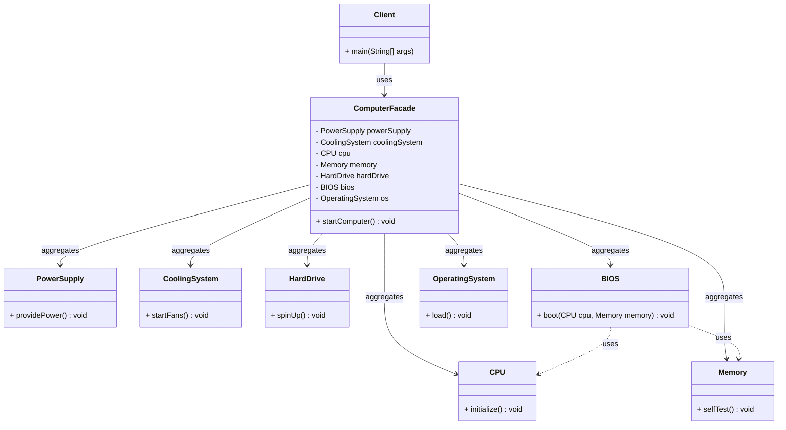

# 💻 Facade Design Pattern

[](https://www.java.com/)
[](https://en.wikipedia.org/wiki/Facade_pattern)


> **A unified interface to a set of interfaces in a subsystem. Facade defines a higher-level interface that makes the subsystem easier to use.**

## 📋 Table of Contents

- [Overview](#-overview)
- [Problem & Solution](#-problem--solution)
- [Class Diagram](#-class-diagram)
- [Implementation](#-implementation)
- [Usage](#-usage)
- [Real-World Example](#-real-world-example)
- [Facade vs Adapter](#-facade-vs-adapter)
- [Key Principles](#-key-principles)


## 🎯 Overview

The **Facade Design Pattern** provides a unified and simplified interface to a set of interfaces in a subsystem. It defines a higher-level interface that makes the subsystem easier to use.

---

## 📌 Principle of Least Knowledge (Law of Demeter)

> A method of an object should only call methods belonging to:

- ✅ The object itself
- ✅ Any object passed in as a parameter
- ✅ Any object the method creates
- ✅ Any object directly held by the object (HAS-A relationship)

🎯 Promotes:

- Reduced coupling
- Better encapsulation
- More maintainable code

---

## 🎯 Intent of Facade Pattern

- To **hide system complexity** from clients
- Provide a **simple interface** to a large subsystem
- Promote **loose coupling** between client and subsystem

### ✅ **Benefits**

- **Simplified Interface**: Reduces learning curve for complex subsystems
- **Loose Coupling**: Shields clients from subsystem changes
- **Better Organization**: Logical grouping of functionality

---

## 🚨 Problem & Solution

### 💥 **Problem**

```java
// Without Facade - Client needs to know about all subsystems
public class ClientWithoutFacade {
    public static void main(String[] args) {
        PowerSupply ps = new PowerSupply();
        CoolingSystem cs = new CoolingSystem();
        CPU cpu = new CPU();
        Memory memory = new Memory();
        HardDrive hd = new HardDrive();
        BIOS bios = new BIOS();
        OperatingSystem os = new OperatingSystem();

        // Complex initialization sequence
        ps.providePower();
        cs.startFans();
        cpu.initialize();
        memory.selfTest();
        bios.boot(cpu, memory);
        hd.spinUp();
        os.load();
    }
}
```

### ✅ **Solution**

```java
// With Facade - Simple interface
public class ClientWithFacade {
    public static void main(String[] args) {
        ComputerFacade computer = new ComputerFacade();
        computer.startComputer(); // One simple method!
    }
}
```

---

## 📦 Class Diagram



## 🚀 Implementation

### 🏗️ **Main Client**

```java
public class FacadeDesignPattern {
    public static void main(String[] args) {
        ComputerFacade computer = new ComputerFacade();
        computer.startComputer();
    }
}
```

### 🎯 **Facade Class**

```java
public class ComputerFacade {
    private final PowerSupply powerSupply = new PowerSupply();
    private final CoolingSystem coolingSystem = new CoolingSystem();
    private final CPU cpu = new CPU();
    private final Memory memory = new Memory();
    private final HardDrive hardDrive = new HardDrive();
    private final BIOS bios = new BIOS();
    private final OperatingSystem os = new OperatingSystem();

    public void startComputer() {
        System.out.println("----- Starting Computer -----");
        powerSupply.providePower();
        coolingSystem.startFans();
        bios.boot(cpu, memory);
        hardDrive.spinUp();
        os.load();
        System.out.println("Computer Booted Successfully!");
    }
}
```

### ⚙️ **Subsystem Classes**

<details>
<summary>Click to view all subsystem implementations</summary>

```java
class PowerSupply {
    public void providePower() {
        System.out.println("Power Supply: Providing power...");
    }
}

class CoolingSystem {
    public void startFans() {
        System.out.println("Cooling System: Fans started...");
    }
}

class CPU {
    public void initialize() {
        System.out.println("CPU: Initialization started...");
    }
}

class Memory {
    public void selfTest() {
        System.out.println("Memory: Self-test passed...");
    }
}

class HardDrive {
    public void spinUp() {
        System.out.println("Hard Drive: Spinning up...");
    }
}

class BIOS {
    public void boot(CPU cpu, Memory memory) {
        System.out.println("BIOS: Booting CPU and Memory checks...");
        cpu.initialize();
        memory.selfTest();
    }
}

class OperatingSystem {
    public void load() {
        System.out.println("Operating System: Loading into memory...");
    }
}
```

</details>

---

## � Usage

### ▶️ **Running the Example**

1. **Compile the Java files:**

   ```bash
   javac *.java
   ```

2. **Run the main class:**
   ```bash
   java FacadeDesignPattern
   ```

### 🎯 **When to Use Facade Pattern**

| ✅ **Use When**                             | ❌ **Don't Use When**                             |
| ------------------------------------------- | ------------------------------------------------- |
| You need to simplify a complex subsystem    | You need to add functionality to existing classes |
| You want to decouple clients from subsystem | You need to convert one interface to another      |
| You have a layered architecture             | The subsystem is already simple                   |
| You need a single entry point               | You need tight coupling with subsystem classes    |

## 🌟 Real-World Example

### 🏠 **Smart Home System**

```java
public class SmartHomeFacade {
    private LightingSystem lights;
    private SecuritySystem security;
    private ClimateControl climate;
    private EntertainmentSystem entertainment;

    public void leaveHome() {
        lights.turnOffAll();
        security.armSystem();
        climate.setAwayMode();
        entertainment.turnOffAll();
    }

    public void arriveHome() {
        security.disarmSystem();
        lights.turnOnEntrance();
        climate.setComfortMode();
        entertainment.turnOnTV();
    }
}
```

## ⚖️ Facade vs Adapter

| Feature      | **Facade Pattern**                           | **Adapter Pattern**                           |
| ------------ | -------------------------------------------- | --------------------------------------------- |
| Purpose      | Simplifies and unifies access to a subsystem | Converts interface of one class into another  |
| Use Case     | Hides complexity                             | Bridges incompatibility between interfaces    |
| Relationship | Wraps a set of existing classes              | Wraps a single class with different interface |
| Focus        | Interface simplification                     | Interface conversion                          |
| Example      | Computer startup with multiple subsystems    | Plug adapter converting 2-pin to 3-pin        |


## 🔑 Key Principles

### 📜 **Law of Demeter (Principle of Least Knowledge)**

> A method should only call methods belonging to:

- ✅ **Itself** - `this.method()`
- ✅ **Parameters passed** - `parameter.method()`
- ✅ **Objects it creates** - `new Object().method()`
- ✅ **Direct components** - `this.component.method()`

### 🎯 **Benefits**

- **🔒 Loose Coupling**: Changes in subsystem don't affect clients
- **🧹 Simplified Interface**: One method instead of many
- **📦 Better Organization**: Groups related functionality
- **🛡️ Encapsulation**: Hides implementation details

