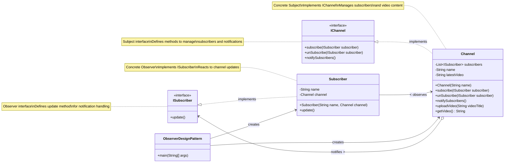

# 📘 Observer Design Pattern - Ultimate Revision Guide

> Everything you need to understand and master the **Observer Design Pattern** — explained step-by-step with code, diagrams, real-world analogies, and usage in projects like your notification system.

## 📋 Table of Contents

- [What Is the Observer Pattern?](#-what-is-the-observer-pattern)
- [Intent](#-intent)
- [Key Components](#-key-components)
- [UML Class Diagram](#-uml-class-diagram-mermaid)
- [Execution Flow](#-execution-flow-text-tree)
- [Advantages](#-advantages)
- [Disadvantages](#-disadvantages)
- [Where It's Used](#-where-its-used)
- [YouTube Channel Example Implementation](#-youtube-channel-example-implementation)
- [Patterns That Pair Well](#-patterns-that-pair-well)
- [Implementation Variations](#-implementation-variations-in-youtube-example)
- [Final Summary](#-final-summary)
- [Key Design Elements](#-key-design-elements-from-observerdesignpatternjava)
- [Quick Reference Card](#-quick-reference-card)
- [Implementation Steps](#-implementation-steps-from-observerdesignpatternjava)

---

## 🎯 What Is the Observer Pattern?

The **Observer Design Pattern** is a **behavioral pattern** that creates a **one-to-many relationship** between objects. When the **subject (observable)** changes, all **dependent observers** are automatically **notified and updated**.

### ✅ Real-World Analogy

> Think of a **YouTube Channel**:
>
> - You post a video (subject changes state).
> - All subscribers (observers) get notified.
> - The channel doesn't need to notify each one manually.

---

## 🧠 Intent

> **"Define a one-to-many dependency between objects so that when one object changes state, all its dependents are notified and updated automatically."**

---

## 🧱 Key Components

| Component          | Role                                             |
| ------------------ | ------------------------------------------------ |
| `Subject`          | Holds the data and notifies observers of changes |
| `Observer`         | Gets updated when subject changes                |
| `ConcreteSubject`  | Implements subject logic                         |
| `ConcreteObserver` | Implements update behavior when notified         |

---

## 🔧 UML Class Diagram (Mermaid)



---

## 🔁 Execution Flow (Text Tree)

```
ObserverDesignPattern.main()
├── Create Channel "CoderArmy"
├── Create Subscribers "Pritam" and "Sunny"
├── channel1.subscribe(subs1)
├── channel1.subscribe(subs2)
├── channel1.uploadVideo("Observer Pattern Tutorial")
│   └── notifySubscribers()
│       ├── subs1.update() // Pritam gets notification
│       └── subs2.update() // Sunny gets notification
├── channel1.unSubscribe(subs2) // Sunny unsubscribes
└── channel1.uploadVideo("Decorator Pattern Tutorial")
    └── notifySubscribers()
        └── subs1.update() // Only Pritam gets notification
```

---

## ✅ Advantages

- Decouples subject and observer
- Easy to add/remove observers dynamically
- Promotes Open/Closed Principle

---

## ❌ Disadvantages

- Too many observers = performance cost
- Complex observer chains may cause infinite loops
- Difficult to debug if observer chain is large

---

## 🛠 Where It's Used

- Event systems (e.g., UI listeners, button clicks)
- Logging systems
- Real-time systems (e.g., stock updates, sensor networks)
- **Your Notification System**

---

## 🧵 YouTube Channel Example Implementation

### Subject:

```java
public interface IChannel {
    void subscribe(ISubscriber subscriber);
    void unSubscribe(ISubscriber subscriber);
    void notifySubscribers();
}

public class Channel implements IChannel {
    // Maintains list of subscribers and video content
}
```

### Observers:

```java
public interface ISubscriber {
    void update();
}

public class Subscriber implements ISubscriber {
    // Gets notified when channel uploads new video
}
```

### Flow:

```text
Channel
└── uploadVideo("New Video Title")
    └── notifySubscribers()
        ├── subscriber1.update()
        ├── subscriber2.update()
        └── ...more subscribers
```

---

## 🔄 Patterns That Pair Well

| Pattern   | Why Use It Together?                |
| --------- | ----------------------------------- |
| Strategy  | Choose notification delivery method |
| Decorator | Add timestamp/signature dynamically |
| Singleton | Global NotificationService          |

---

## 🧪 Implementation Variations in YouTube Example

### Pull Model (Used in the Example):

```java
// In the Subscriber class
@Override
public void update() {
    // Subscriber pulls data from Channel
    String videoInfo = channel.getVideo();
    System.out.println("Hey" + name + ", " + videoInfo);
}
```

This is a **pull model** because:

- The Channel only notifies subscribers that a new video is uploaded
- Subscribers then pull the video information using `channel.getVideo()`
- Each subscriber decides what information they need from the channel

### Push Model Alternative:

```java
// Modified interface
interface ISubscriber {
    void update(String videoTitle);
}

// In the Channel class
public void notifySubscribers() {
    for (ISubscriber sub : subscribers) {
        sub.update(latestVideo);  // Push the data directly
    }
}
```

This would be a **push model** because:

- The Channel pushes the video information directly to subscribers
- Subscribers receive the data without having to request it

### Preventing Memory Leaks:

In your example, subscribers have a strong reference to the channel:

```java
private Channel channel;  // Strong reference
```

For large-scale applications, consider using weak references:

```java
// Using WeakReference to prevent memory leaks
private final WeakReference<Channel> channelRef;

public Subscriber(String name, Channel channel) {
    this.name = name;
    this.channelRef = new WeakReference<>(channel);
}

@Override
public void update() {
    Channel channel = channelRef.get();
    if (channel != null) {
        System.out.println("Hey" + name + ", " + channel.getVideo());
    }
}
```

---

## 📌 Final Summary

```text
Observer pattern is perfect when:
✔ You want to react automatically to changes
✔ You need a scalable event-notification system
✔ You don't want tight coupling between logic layers
```

✅ **Mastered!** This guide has everything you need to revise, implement, and explain the **Observer Design Pattern** with confidence.

---

## 📚 Key Design Elements from ObserverDesignPattern.java

### 1. Observer Interface (ISubscriber)

```java
interface ISubscriber {
    void update();
}
```

### 2. Subject Interface (IChannel)

```java
interface IChannel {
    void subscribe(ISubscriber subscriber);
    void unSubscribe(ISubscriber subscriber);
    void notifySubscribers();
}
```

### 3. Concrete Subject (Channel)

```java
class Channel implements IChannel {
    private List<ISubscriber> subscribers;
    private String name;
    private String latestVideo;

    // Constructor, subscription management, and business methods
    // ...
}
```

### 4. Concrete Observer (Subscriber)

```java
class Subscriber implements ISubscriber {
    private String name;
    private Channel channel;

    // Constructor and update implementation
    // ...
}
```

### 5. Client Code Pattern

```java
Channel channel = new Channel("ChannelName");
Subscriber subscriber = new Subscriber("SubscriberName", channel);
channel.subscribe(subscriber);
channel.uploadVideo("Video Title"); // Triggers notification
```

---

## 📝 Quick Reference Card

| Concept             | Description                                                         |
| ------------------- | ------------------------------------------------------------------- |
| **Definition**      | One-to-many dependency relationship                                 |
| **When to use**     | When changes in one object affect multiple others                   |
| **Core interfaces** | `ISubscriber` (update), `IChannel` (subscribe, unSubscribe, notify) |
| **Key benefit**     | Decoupled communication between objects                             |
| **Warning**         | Beware of cascading updates and memory leaks                        |
| **Common examples** | YouTube subscriptions, event handlers, notification systems         |
| **Your Example**    | YouTube channel notifying subscribers about new videos              |

## 🚀 Implementation Steps (From ObserverDesignPattern.java)

1. **Define the Observer interface (ISubscriber)**

   - Create interface with `update()` method that will be called when the subject changes
   - This is implemented by `Subscriber` class in the example

2. **Define the Subject interface (IChannel)**

   - Create interface with methods:
     - `subscribe(ISubscriber)` - Add an observer
     - `unSubscribe(ISubscriber)` - Remove an observer
     - `notifySubscribers()` - Notify all observers
   - This is implemented by `Channel` class in the example

3. **Implement the Concrete Subject (Channel)**

   - Maintain a collection of subscribers: `private List<ISubscriber> subscribers`
   - Implement subscription management methods:
     - `subscribe()` - Add subscriber to list if not already present
     - `unSubscribe()` - Remove subscriber from list
     - `notifySubscribers()` - Loop through all subscribers and call update()
   - Add business methods that change state:
     - `uploadVideo(String videoTitle)` - Sets latest video and notifies subscribers
   - Provide methods for observers to query state:
     - `getVideo()` - Returns latest video information

4. **Implement the Concrete Observer (Subscriber)**

   - Store a reference to the subject: `private Channel channel`
   - Implement the `update()` method to respond to notifications
   - Usually queries the subject for state changes: `channel.getVideo()`

5. **Client Implementation (ObserverDesignPattern.main)**
   - Create a concrete subject: `Channel channel1 = new Channel("CoderArmy")`
   - Create concrete observers: `Subscriber subs1 = new Subscriber("Pritam", channel1)`
   - Register observers with the subject: `channel1.subscribe(subs1)`
   - Trigger state change: `channel1.uploadVideo("Observer Pattern Tutorial")`
   - Optionally unregister observers: `channel1.unSubscribe(subs2)`

---

> 💡 **Revision Tip**: Review this document before system design interviews or when implementing notification-based features in your projects.

```

```
