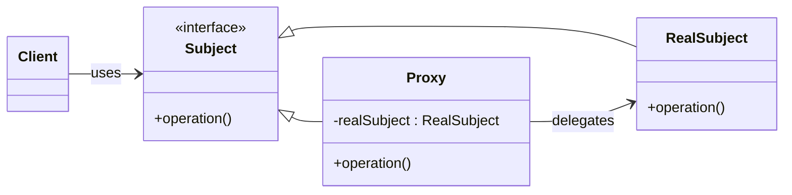

# 🧱 Proxy Design Pattern (Structural)

## 📌 Intent

> Provide a surrogate or placeholder for another object to control access to it.

The **Proxy Pattern** is used to:

- Add a layer of control (e.g., permission, lazy loading, remote communication).
- Avoid the cost or risk of directly accessing a heavy or sensitive object.

---

## 🎯 Real-World Examples

- **Virtual Proxy**: Lazy-loading images or documents (e.g., thumbnail preview in Google Docs).
- **Protection Proxy**: Premium user checks before unlocking features (e.g., file access).
- **Remote Proxy**: Accessing a server's resources as if they were local (e.g., REST client stubs).

---

## 🧠 Participants

| Component       | Description                                                  |
| --------------- | ------------------------------------------------------------ |
| **Subject**     | Interface or abstract class defining the common interface    |
| **RealSubject** | The real object that does the actual work                    |
| **Proxy**       | The placeholder controlling access to `RealSubject`          |
| **Client**      | Uses the proxy instead of accessing the real object directly |

---

## 🧪 Java Code Examples

### 🔸 Virtual Proxy

```java
interface IImage { void display(); }

class RealImage implements IImage {
    private final String filename;
    public RealImage(String filename) {
        this.filename = filename;
        loadFromDisk();
    }
    private void loadFromDisk() {
        System.out.println("Loading " + filename);
    }
    public void display() {
        System.out.println("Displaying " + filename);
    }
}

class ImageProxy implements IImage {
    private RealImage realImage;
    private final String filename;
    public ImageProxy(String filename) {
        this.filename = filename;
    }
    public void display() {
        if (realImage == null) {
            realImage = new RealImage(filename); // Lazy load
        }
        realImage.display();
    }
}
```

---

### 🔸 Protection Proxy

```java
interface IDocumentReader { void unlockPDF(String file, String password); }

class RealDocumentReader implements IDocumentReader {
    public void unlockPDF(String file, String password) {
        System.out.println("Unlocking: " + file + " with " + password);
    }
}

class User {
    public String name;
    public boolean premium;
    public User(String name, boolean premium) {
        this.name = name;
        this.premium = premium;
    }
}

class DocumentProxy implements IDocumentReader {
    private final RealDocumentReader realReader = new RealDocumentReader();
    private final User user;
    public DocumentProxy(User user) {
        this.user = user;
    }
    public void unlockPDF(String file, String password) {
        if (!user.premium) {
            System.out.println("Access denied for " + user.name);
        } else {
            realReader.unlockPDF(file, password);
        }
    }
}
```

---

### 🔸 Remote Proxy

```java
interface IDataService {
    String fetchData();
    void connect();
    void disconnect();
}

class RealDataService implements IDataService {
    private boolean connected = false;
    public void connect() {
        connected = true;
        System.out.println("Connected to remote server");
    }
    public void disconnect() {
        connected = false;
        System.out.println("Disconnected");
    }
    public String fetchData() {
        return connected ? "Remote data" : "Not connected";
    }
}

class DataServiceProxy implements IDataService {
    private final RealDataService realService = new RealDataService();
    public void connect() {
        System.out.println("Proxy connecting...");
        realService.connect();
    }
    public void disconnect() {
        System.out.println("Proxy disconnecting...");
        realService.disconnect();
    }
    public String fetchData() {
        System.out.println("Proxy fetching data...");
        return realService.fetchData();
    }
}
```

---

## ⚖️ Types of Proxy – Comparison Table

| Feature                | Virtual Proxy                    | Protection Proxy                     | Remote Proxy                      |
| ---------------------- | -------------------------------- | ------------------------------------ | --------------------------------- |
| **Purpose**            | Delay object creation            | Restrict access based on permissions | Communicate with remote object    |
| **When used?**         | Expensive objects (e.g., images) | Premium features, access control     | Network-based resource access     |
| **Key Behavior**       | Lazy initialization              | Authorization check                  | Delegates calls to remote service |
| **Real-World Analogy** | Image viewers                    | Parental control, user roles         | API client, RPC                   |
| **Client knows real?** | No                               | Possibly                             | No                                |

---

## 📈 UML Class Diagram (Mermaid)



---

## ✅ Advantages

- Controls access to the real object.
- Adds lazy loading, caching, authentication, logging, etc.
- Decouples the client from the complexity of the real object.

## 🚫 Disadvantages

- Code becomes more complex.
- Performance overhead due to indirection.
- Some proxies can violate the **Open/Closed Principle** if not designed properly.

---

## 📚 Summary

| Pattern       | Key Use Case                      | Example                                    |
| ------------- | --------------------------------- | ------------------------------------------ |
| Virtual Proxy | Postpone heavy object creation    | Load images only on `display()` call       |
| Protection    | Access control                    | Check if user is premium before unlocking  |
| Remote        | Represent remote resource locally | Act like local client to fetch remote data |

---

## 🏁 Conclusion

Use the **Proxy Design Pattern** when:

- You need a placeholder or representative object.
- Access needs to be controlled, delayed, or redirected.
- The real object is remote, sensitive, or resource-intensive.

---

