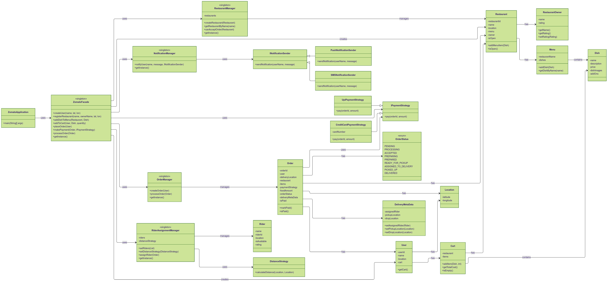

# 🍔 JomatoClone – Zomato Food Delivery System (Java, OOP, UML)

A modular, object-oriented simulation of a Zomato-like food ordering and delivery platform built in Java. This project demonstrates clean architecture, design patterns, and UML-driven planning for system design learning.

---

## 📁 Folder Structure

```
JomatoClone/
├── enums/                # Enum types (OrderStatus, Rating)
├── managers/             # Singleton managers (OrderManager, RestaurantManager, etc.)
├── models/               # Core domain models (User, Restaurant, Order, etc.)
├── service/              # Support services (NotificationManager, DistanceStrategy)
├── strategies/           # Strategy interfaces and implementations
├── utils/                # Utility classes (IdGeneration, TimeUtils)
├── ZomatoFacade.java     # Facade for system operations (Singleton)
├── ZomatoApplication.java# Main entry point
└── README.md             # Project documentation
```

---

## ⚙️ Actual Flow (End-to-End)

1. **User Signup & Carting**: User is created with a location and empty cart. User browses restaurants and adds dishes to the cart.
2. **Restaurant Registration**: Admin registers a new restaurant and menu via `ZomatoFacade`.
3. **Order Placement**: If the restaurant is open, the order is created via `OrderManager`. An order contains user info, dishes, and delivery location.
4. **Payment**: Payment strategy (UPI, Credit Card) is set on the order. Strategy's `pay()` method processes payment.
5. **Order Processing**: Once paid, the order goes through food preparation and is assigned to a rider using `RiderAssignmentManager` + `DistanceStrategy`.
6. **Delivery & Notification**: Order is delivered via `DeliveryManager`. `NotificationManager` sends delivery updates via `INotificationSender`.

---

## 🧠 Design Patterns Used

| Pattern                    | Description                                                                                                 |
| -------------------------- | ----------------------------------------------------------------------------------------------------------- |
| **Singleton**              | Ensures only one instance of all managers: `OrderManager`, `RestaurantManager`, `NotificationManager`, etc. |
| **Strategy**               | Flexible payment (`IPaymentStrategy`) and distance calculation (`DistanceStrategy`)                         |
| **Facade**                 | `ZomatoFacade` hides complexity and provides a simple interface for clients                                 |
| **Enum**                   | `OrderStatus` tracks lifecycle states of an order                                                           |
| **Interface-Based Design** | `INotificationSender`, `IPaymentStrategy` promote loose coupling and flexibility                            |

---

## 🛕 UML Diagram

Visual class diagram of the entire system:



---

## 🚀 How to Run

1. Compile:

   ```bash
   javac JomatoClone/**/*.java
   ```

2. Run:

   ```bash
   java JomatoClone.ZomatoApplication
   ```

---

## 📌 Example Features

- Rider distance calculated with **HaversineDistanceStrategy**
- Payment processed with **Strategy pattern** (UPI, Credit Card, etc.)
- Notifications sent using **INotificationSender** interface
- All managers follow **lazy-loaded Singleton** structure
- `ZomatoFacade` orchestrates all user operations for clean testing

---

## 👏 Acknowledgements

Built as a system design learning project. Inspired by the structure of real-world food delivery apps, OOP best practices, and UML modeling.
