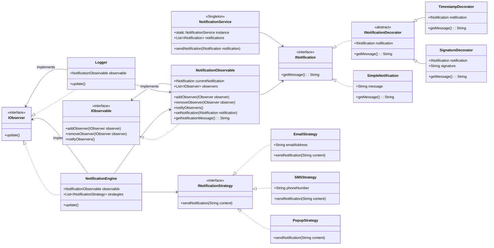

# 🧠 Notification System - Full Design Walkthrough

> A **Decorator + Strategy + Observer + Singleton** based notification system, crafted for **modularity**, **extensibility**, and **real-world applicability**.

## 📋 Table of Contents

- [Motivation](#-motivation)
- [Step-by-Step Design & Build](#️-step-by-step-design--build)
- [Execution Flow](#-execution-flow-step-by-step)
- [Why This Design?](#-why-this-design-pros)
- [What Not to Do](#-what-not-to-do)
- [Future Enhancements](#-future-enhancements)
- [Summary](#-summary)
- [Class Diagram](#-class-diagram)
- [Usage](#-usage)
- [Acknowledgements](#-acknowledgements)

---

## 📌 Motivation

Modern applications require **dynamic notification systems**. These systems:

- Must support **multiple delivery channels** (Email, SMS, Popups…)
- Should allow **chaining decorators** (like adding timestamps or signatures)
- Should **react automatically** when new notifications arrive
- And be **easy to extend**, without rewriting everything

So, instead of just writing `sendEmail("Hi")`, we built a **production-grade notification engine** using design patterns. Here's how we built it — one step at a time.

---

## 🛠️ Step-by-Step Design & Build

---

### ✅ Step 1: Core Abstraction - `INotification`

We start with the heart of the system: `INotification`.

```java
interface INotification {
    String getMessage();
}
```

This is an **interface** for anything that can represent a notification. Think of it as a "blueprint" for notification messages.

---

### ✅ Step 2: Basic Message - `SimpleNotification`

Now we need a simple message type.

```java
class SimpleNotification implements INotification {
    private String message;

    public SimpleNotification(String message) {
        this.message = message;
    }

    @Override
    public String getMessage() {
        return message;
    }
}
```

This gives us our raw message like `"Welcome to the app!"`.

---

### ✅ Step 3: 🎨 Decorators - Adding Timestamp & Signature

We want to **dynamically add info** to a message like:

- `[2025-07-15] Welcome`
- `Welcome - Team App`

To avoid creating dozens of subclasses (e.g., `TimestampAndSignatureNotification`), we use the **Decorator Pattern**.

```java
abstract class INotificationDecorator implements INotification {
    protected INotification notification;

    public INotificationDecorator(INotification notification) {
        this.notification = notification;
    }
}

class TimestampDecorator extends INotificationDecorator {
    public TimestampDecorator(INotification notification) {
        super(notification);
    }

    @Override
    public String getMessage() {
        LocalDateTime now = LocalDateTime.now();
        DateTimeFormatter formatter = DateTimeFormatter.ofPattern("yyyy-MM-dd HH:mm:ss");
        String formattedDateTime = now.format(formatter);
        return "[" + formattedDateTime + "] " + notification.getMessage();
    }
}

class SignatureDecorator extends INotificationDecorator {
    private String signature;

    public SignatureDecorator(INotification notification, String signature) {
        super(notification);
        this.signature = signature;
    }

    @Override
    public String getMessage() {
        return notification.getMessage() + " - " + signature;
    }
}
```

Now we can chain:

```java
INotification notification = new SimpleNotification("Hi");
notification = new TimestampDecorator(notification);
notification = new SignatureDecorator(notification, "Team App");
```

---

### ✅ Step 4: 👀 Observer Pattern - Auto-Reactive System

When a new notification is created, multiple components should react (like loggers or delivery systems). We use **Observer Pattern**.

```java
interface IObservable {
    void addObserver(IObserver observer);
    void removeObserver(IObserver observer);
    void notifyObservers();  // calls update on all observers
}

interface IObserver {
    void update();
}
```

---

### ✅ Step 5: Observable Wrapper - `NotificationObservable`

```java
class NotificationObservable implements IObservable {
    private INotification currentNotification;

    public void setNotification(INotification notification);
    public String getNotificationMessage();
}
```

This acts as the **shared subject** that observers listen to.

---

### ✅ Step 6: Logger Observer - `Logger`

```java
class Logger implements IObserver {
    private NotificationObservable observable;

    @Override
    public void update() {
        System.out.println("Logger: New notification received - " + observable.getNotificationMessage());
    }
}
```

This will print every notification received — for debugging or logging purposes.

---

### ✅ Step 7: 🎯 Strategy Pattern - Send Notification by Channel

We now want **multiple ways to send** a notification: SMS, Email, Popup.

```java
interface INotificationStrategy {
    void sendNotification(String content);
}

class EmailStrategy implements INotificationStrategy {
    private String emailAddress;

    @Override
    public void sendNotification(String content) {
        System.out.println("Sending Email Notification: " + content);
    }
}
```

You can now extend this system without changing a single existing class!

---

### ✅ Step 8: Notification Engine - `NotificationEngine`

This is the **main controller**.

```java
class NotificationEngine implements IObserver {
    private NotificationObservable observable;
    private List<INotificationStrategy> strategies = new ArrayList<>();

    @Override
    public void update() {
        String notificationMessage = observable.getNotificationMessage();
        for (INotificationStrategy strategy : strategies) {
            strategy.sendNotification(notificationMessage);
        }
    }
}
```

It listens for updates, grabs the content, and pushes it to all delivery strategies.

---

### ✅ Step 9: Singleton - `NotificationService`

We want a **global access point** that maintains all notifications sent so far.

```java
class NotificationService {
    private static NotificationService instance;
    private NotificationObservable observable;
    private List<INotification> notifications = new ArrayList<>();

    public static NotificationService getInstance() {
        if (instance == null) {
            instance = new NotificationService();
        }
        return instance;
    }

    public void sendNotification(INotification notification) {
        observable.setNotification(notification);
        notifications.add(notification);
    }
}
```

This avoids unnecessary duplication and gives centralized access.

---

## 🧵 Execution Flow (Step-by-Step)

1. **Client builds a notification**:

   ```java
   INotification notif = new SignatureDecorator(
                         new TimestampDecorator(
                         new SimpleNotification("Welcome")), "Customer Care");

   NotificationService.getInstance().sendNotification(notif);
   ```

2. `NotificationService::sendNotification()` sets this `notif` in `NotificationObservable`.

3. `NotificationObservable::notify()` calls `update()` on all registered observers.

4. - `Logger::update()` logs the content.
   - `NotificationEngine::update()` pulls the content and pushes it via each delivery strategy:

     - Email
     - SMS
     - Pop-up

---

## ✅ Why This Design? Pros

| Feature                                 | Design Choice                         |
| --------------------------------------- | ------------------------------------- |
| Add/remove message metadata dynamically | ✅ **Decorator Pattern**              |
| Multiple delivery options               | ✅ **Strategy Pattern**               |
| Log + Send both                         | ✅ **Observer Pattern**               |
| One instance controlling everything     | ✅ **Singleton Pattern**              |
| Easy to extend                          | ✅ **Open/Closed Principle**          |
| No tight coupling                       | ✅ **Dependency Inversion Principle** |

---

## ❌ What Not to Do

| Mistake                              | Why It’s Bad                         |
| ------------------------------------ | ------------------------------------ |
| Hardcode delivery logic in engine    | Violates SRP and makes it untestable |
| Inherit for every combo of decorator | Leads to **class explosion**         |
| Use multiple global variables        | Breaks **Singleton + Clean Access**  |
| Mix UI (like Popups) in core classes | Hurts modularity                     |

---

## 🚀 Future Enhancements

- ✅ Add RetryStrategy if SMS fails
- ✅ Allow scheduling of notifications (Delayed send)
- ✅ Webhooks or 3rd party integrations (e.g., Discord/Slack)
- ✅ Admin dashboard to toggle strategies
- ✅ Persistent logging to file or DB

---

## 📎 Summary

This system combines **four major design patterns**:

- 🧩 **Decorator**: Enhances content
- 🔄 **Strategy**: Sends via different mediums
- 🛰 **Observer**: Notifies all listeners
- 🔐 **Singleton**: Manages centralized sending

And the best part? It's easily extensible, readable, and modular.

---

## 📊 Class Diagram



## 📱 Usage

```java
// Create a basic notification
INotification notification = new SimpleNotification("Welcome to our service!");

// Add decorators
notification = new TimestampDecorator(notification);
notification = new SignatureDecorator(notification, "Customer Care");

// Send through the notification service
NotificationService.getInstance().sendNotification(notification);
```

---

> ✅ Made for revision. Come back anytime to refresh your concepts before an interview or implementation.

---

## 💖 Acknowledgements

Built with passion and precision by Pritam. Transforming complex design patterns into elegant, maintainable code.
