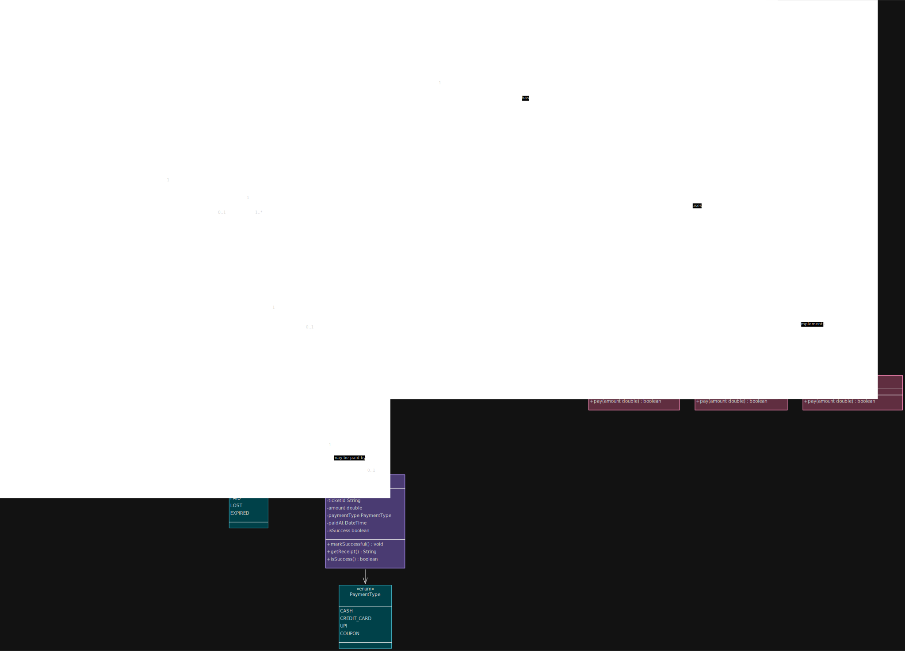

# 🚗 Parking Lot UML — Short Summary

- `Car`, `Bus`, and `MotorCycle` **extend** `Vehicle` (Inheritance / IS-A relationship). ([CalibreOS][1])

- `HourlyPricing` and `FlatPricing` **implement** `PricingStrategy` interface (Realization). ([UMLBoard's Website][2])

- `ParkingLot` **has** multiple:
  - `ParkingFloor`
    - `EntrancePanel`
    - `ExitPanel`

  using **Composition** (`*--`) because these components belong to the parking lot lifecycle. ([Go UML][3])

- `ParkingFloor` **contains** many `ParkingSpot` objects using **Composition**. ([Go UML][3])

- `Vehicle` is **associated with** `ParkingSpot` because a vehicle can park in a spot. ([JSware][4])

- `ParkingSpot` is associated with `ParkingTicket`.

- `ParkingTicket` is associated with `Payment`.

- `ParkingLot` **uses** `PricingStrategy` for fee calculation (Dependency / Strategy Pattern). ([UMLBoard's Website][2])

- `Vehicle` depends on `VehicleSize` enum.

- `ParkingSpot` depends on `SpotType` enum.

- `ParkingTicket` depends on `TicketStatus` enum.

- `Payment` depends on `PaymentType` enum.

- `ParkingLot` depends on `LotStatus` enum.
  Vehicle <|-- Motorcycle

# 📌 Main Design Patterns

| Pattern           | Used In                   |
| ----------------- | ------------------------- |
| Strategy Pattern  | PricingStrategy           |
| Singleton Pattern | ParkingLot                |
| Inheritance       | Vehicle hierarchy         |
| Composition       | ParkingLot → Floors/Spots |
| Abstraction       | Vehicle                   |
| Interface         | PricingStrategy           |

# 📌 Overall Flow

```text
Vehicle
   ↓
ParkingSpot
   ↓
ParkingTicket
   ↓
Payment
```

```text
ParkingLot
 ├── ParkingFloor
 │      └── ParkingSpot
 │
 ├── EntrancePanel
 ├── ExitPanel
 │
 └── PricingStrategy
 │      ├── HourlyPricing
 │      └── FlatPricing
 └── PaymentStrategy
         ├── UPIPayment
         ├── CashPayment
         └── CreditCardPayment
```

## Run the small demo

Build and run the concise demo included in `Main.main()`.

Windows (PowerShell):

```powershell
cd (Get-Location)
if (!(Test-Path out)) { New-Item -ItemType Directory -Path out }
javac -d out (Get-ChildItem -Recurse -Filter *.java | ForEach-Object { $_.FullName })
java -cp out Main
```

Unix / macOS:

```bash
find . -name "*.java" | xargs javac -d out
java -cp out Main
```

This compiles all sources into `out/` and runs the small entry/exit flow demonstration (entry point: the `Main` class).
