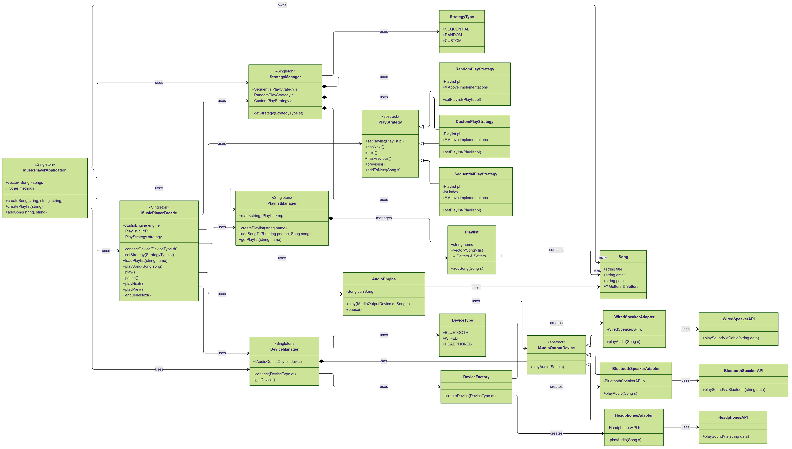

# 🎵 Music Player Application – Design Patterns Architecture

This project represents a modular, extensible **Music Player App** implemented with core object-oriented design principles and **classic design patterns** like Singleton, Facade, Factory, Strategy, Adapter, and more.

---

## 📦 Table of Contents

- [🚀 Application Overview](#-application-overview)
- [🔁 Step-by-Step Flow](#-step-by-step-flow)
- [🧠 Design Patterns Used](#-design-patterns-used)
- [📊 Component Flow Diagram](#-component-flow-diagram)
- [🎯 Benefits of This Design](#-benefits-of-this-design)
- [📌 Extensibility Ideas](#-extensibility-ideas)

---

## 🚀 Application Overview

The **MusicPlayerApplication** acts as the central controller, coordinating song playback, playlist management, playback strategies, and output devices through a set of manager classes.

---

## 🔁 Step-by-Step Flow

### ✅ Step 1: App Startup

`MusicPlayerApplication` (Singleton) is the main controller of your app.

It creates/initializes:

- `MusicPlayerFacade` to abstract all subsystems
- `PlaylistManager`, `DeviceManager`, `StrategyManager`

---

### ✅ Step 2: Song & Playlist Creation

- `createSong()` → Adds a Song to the app's collection.
- `createPlaylist(name)` → Uses `PlaylistManager` to create a `Playlist` object.
- `addSong(song, playlistName)` → Adds a song to a playlist via `PlaylistManager`.

---

### ✅ Step 3: Strategy & Device Setup

- `setStrategy(StrategyType)` → Uses `StrategyManager` to pick a play strategy like:

  - `SequentialPlayStrategy`
  - `RandomPlayStrategy`
  - `CustomPlayStrategy`

- `connectDevice(DeviceType)` → `DeviceManager` uses `DeviceFactory` to instantiate:
  - `BluetoothSpeakerAdapter`
  - `WiredSpeakerAdapter`
  - `HeadphonesAdapter`

---

### ✅ Step 4: Play Song

- `playSong(song)` →  
  `MusicPlayerFacade` sends song + device to `AudioEngine`  
  `AudioEngine` plays it using the selected `IAudioOutputDevice`

---

### ✅ Step 5: Navigation

- User can call:

  - `playNext()`
  - `playPrev()`
  - `enqueueNext()`

- These are implemented through the current `PlayStrategy`.

---

## 🧠 Design Patterns Used

| Pattern                           | Classes                                                                                              | Why Used                                                                                                                                |
| --------------------------------- | ---------------------------------------------------------------------------------------------------- | --------------------------------------------------------------------------------------------------------------------------------------- |
| **Singleton**                     | `MusicPlayerApplication`, `MusicPlayerFacade`, `PlaylistManager`, `DeviceManager`, `StrategyManager` | To ensure **only one instance** of each core manager exists across the app. Prevents duplicates, central control.                       |
| **Facade**                        | `MusicPlayerFacade`                                                                                  | Simplifies the interface to **multiple subsystems** (strategy, device, audio, playlist). Makes the app easier to use.                   |
| **Factory Method**                | `DeviceFactory`                                                                                      | Allows creation of various device adapters (`Bluetooth`, `Wired`, etc.) without the app knowing the exact class. Adds flexibility.      |
| **Adapter**                       | `BluetoothSpeakerAdapter`, `WiredSpeakerAdapter`, `HeadphonesAdapter`                                | Converts different third-party audio APIs (e.g., `BluetoothSpeakerAPI`) to a common interface `IAudioOutputDevice`. Ensures uniformity. |
| **Strategy**                      | `PlayStrategy` (abstract), `SequentialPlayStrategy`, `RandomPlayStrategy`, `CustomPlayStrategy`      | Encapsulates different ways of playing songs. Easy to switch strategies at runtime without modifying client code.                       |
| **Composition / Aggregation**     | `Playlist` \*-- `Song`, `PlaylistManager` \*-- `Playlist`                                            | Represents **ownership** and **1-to-many** relationships. `Playlist` contains songs; `PlaylistManager` manages many playlists.          |
| **Dependency Injection (manual)** | Fields like `AudioEngine`, `PlayStrategy`, `IAudioOutputDevice` in `MusicPlayerFacade`               | Loosely couples classes; makes it easy to replace strategies or devices at runtime.                                                     |

--- |

---

## 🔰 UML Diagram



---

## 📊 Component Flow Diagram

```text
User Input
   ↓
MusicPlayerApplication (Singleton)
   ↓
MusicPlayerFacade (Facade)
   ├──→ PlaylistManager → Playlist → Songs
   ├──→ StrategyManager → PlayStrategy (Sequential/Random/Custom)
   ├──→ DeviceManager ──→ DeviceFactory → Audio Output Adapters
   └──→ AudioEngine ─────→ IAudioOutputDevice.playAudio(Song)
```

---

## 🎯 Benefits of This Design

- ✅ Highly maintainable and loosely coupled components
- 🧩 New devices or strategies can be added with minimal changes
- 🚀 Scales well for future features like shuffle queue, favorites, streaming, etc.
- 🛠️ Easy unit testing due to single responsibility and abstraction

---

## 📌 Extensibility Ideas

- 🎙️ Add support for streaming APIs (Spotify, YouTube Music)
- 📻 Implement Equalizer Strategy
- 📅 Add scheduling feature for auto-play
- 🔐 Role-based access if turned into a multi-user app

```

```
