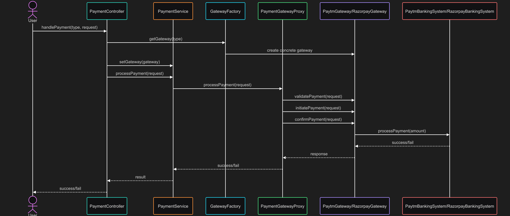

# 💳 Payment Gateway System (Java OOP Design)

A flexible, extendable, and cleanly designed **Payment Gateway System** using OOP principles in Java. Supports ## 📊 Diagram Relation Summary*multiple payment gateways** (Paytm, Razorpay) and uses **proxy + factory patterns** to delegate logic and isolate gateway implementation.

## 📋 Table of Contents
- [Goal](#-goal)
- [Design Patterns Used](#-design-patterns-used)
- [System Architecture](#-system-architecture)
- [Folder Structure](#️-folder-structure)
- [Sequence Diagram](#-sequence-diagram)
- [End-to-End Flow](#-end-to-end-flow-step-by-step)
- [File Implementation Order](#️-file-implementation-order)
- [Example Use](#-example-use)
- [Output Sample](#-output-sample)


## ✅ Goal

Allow a user to initiate a payment via a selected gateway (Paytm or Razorpay) while abstracting away implementation details and enforcing clean architecture using design patterns.

## 🧠 Design Patterns Used

| Pattern | Used In | Why Used |
|--------|---------|----------|
| **Factory Pattern** | `GatewayFactory` | Decouples object creation from usage. Easily add new gateways. |
| **Proxy Pattern** | `PaymentGatewayProxy` | Adds behavior (logging, retries) before delegating to real gateway. |
| **Strategy Pattern** | `PaymentGateway`, `PaytmGateway`, `RazorpayGateway` | Switches between gateway implementations dynamically. |
| **Singleton Pattern** | `PaymentController`, `PaymentService`, `GatewayFactory` | Ensures single instances of core service classes. |
| **Composition** | Gateways contain respective BankingSystems | Delegates fund processing to external systems. |
| **Interface** | `BankingSystem` | Enforces common behavior for different bank systems. |

## 🏗 System Architecture

The Payment Gateway System is built with a clear separation of concerns and follows SOLID principles:


*UML Class Diagram of the Payment Gateway System*

## 🗂️ Folder Structure

```
src/
├── bank/
│   ├── BankingSystem.java
│   ├── PaytmBankingSystem.java
│   └── RazorpayBankingSystem.java
├── controller/
│   └── PaymentController.java
├── factory/
│   └── GatewayFactory.java
├── gateway/
│   ├── PaymentGateway.java
│   ├── PaytmGateway.java
│   ├── RazorpayGateway.java
│   └── PaymentGatewayProxy.java
├── model/
│   ├── PaymentRequest.java
│   └── GatewayType.java
├── service/
│   └── PaymentService.java
├── PaymentGatewayApplication.java
└── README.md
```

## � Sequence Diagram

The following sequence diagram shows the complete flow of a payment transaction:



*Payment Processing Sequence Diagram*

## 🔁 End-to-End Flow (Step-by-Step)

### ✅ 1. User Initiates Payment via Controller
The entry point is:

```java
PaymentController.handlePayment(GatewayType, PaymentRequest)
```

The user/client sends a PaymentRequest that contains:
- sender
- receiver
- amount
- currency

Along with the GatewayType (either PAYTM or RAZORPAY)

### 🧠 2. Controller Handles Request
PaymentController is a singleton and has a reference to:
- PaymentService (singleton)
- GatewayFactory (singleton)

It calls:

```java
PaymentGateway gateway = GatewayFactory.getGateway(GatewayType);
```

Then sets the gateway into the service:

```java
service.setGateway(gateway);
```
### 🧰 3. Factory Creates Proper Gateway
GatewayFactory.getGateway(type) checks:
- If type == PAYTM: creates PaytmGateway
- If type == RAZORPAY: creates RazorpayGateway

Both extend the abstract class PaymentGateway

### 🛡️ 4. Proxy Wraps the Real Gateway
PaymentService.setGateway(pg) wraps it in a PaymentGatewayProxy

This proxy might add logging, security, retries, etc.

The service now uses:

```java
proxy.processPayment(request);
```
### 🔄 5. Gateway Logic: 3-Step Payment
Each gateway (Paytm or Razorpay) implements:
- validatePayment(request)
- initiatePayment(request)
- confirmPayment(request)

These steps are executed in PaymentGateway.processPayment() (abstract or template method style).

Example:
```java
validatePayment(request);
initiatePayment(request);
confirmPayment(request);
```
### 🏦 6. Banking System Executes Transfer
Inside initiatePayment or confirmPayment, each gateway uses its corresponding BankingSystem:
- PaytmGateway has: PaytmBankingSystem
- RazorpayGateway has: RazorpayBankingSystem

Both implement:

```java
BankingSystem.processPayment(amount)
```

This is where the actual transfer logic happens.

### ✅ 7. Payment Done — Response to Controller
After confirmation, response bubbles back:

From Gateway → to Proxy → to Service → to Controller

The PaymentController can then return a success/failure response to the client.

## � Diagram Relation Summary

| Class | Type | Relationships & Notes |
|-------|------|----------------------|
| PaymentController | Singleton | Uses PaymentService, GatewayFactory, receives PaymentRequest |
| GatewayFactory | Singleton | Creates gateway based on GatewayType |
| PaymentService | Singleton | Uses PaymentGatewayProxy, which delegates to actual PaymentGateway |
| PaymentGatewayProxy | Wrapper | Delegates calls to the real PaymentGateway |
| PaymentGateway | Abstract | Defines validate/initiate/confirm methods |
| PaytmGateway | Concrete | Composed with PaytmBankingSystem, implements the 3-step logic |
| RazorpayGateway | Concrete | Composed with RazorpayBankingSystem |
| BankingSystem | Interface | Both banking systems implement this to execute payment |

### 🎯 Final Flow Summary (One Line per Step)
- Client → PaymentController: Sends PaymentRequest + GatewayType
- Controller → Factory: Gets correct PaymentGateway
- Controller → Service: Injects gateway (via proxy)
- Service → Proxy → Gateway: Calls processPayment
- Gateway: Runs validate → initiate → confirm
- BankingSystem: Executes actual payment

## 🏗️ File Implementation Order

Recommended coding order for step-by-step development:

1. 📝 model/PaymentRequest.java  
2. 🏷️ model/GatewayType.java  
3. 🏦 bank/BankingSystem.java  
4. 💳 bank/PaytmBankingSystem.java  
5. 💳 bank/RazorpayBankingSystem.java  
6. 🧩 gateway/PaymentGateway.java  
7. 💵 gateway/PaytmGateway.java  
8. 💵 gateway/RazorpayGateway.java  
9. 🛡️ gateway/PaymentGatewayProxy.java  
10. 🏭 factory/GatewayFactory.java  
11. 🔧 service/PaymentService.java  
12. 👑 controller/PaymentController.java  
13. 🚀 PaymentGatewayApplication.java  


## 📌 Example Use (`PaymentGatewayApplication.java`)

```java
public class PaymentGatewayApplication {
    public static void main(String[] args) {
        PaymentRequest request = new PaymentRequest("Alice", "Bob", 500.00, "INR");
        boolean result = PaymentController.getInstance().handlePayment(GatewayType.PAYTM, request);
        System.out.println("Result: " + (result ? "SUCCESS" : "FAIL"));
    }
}
```

## 📈 Output Sample

```
Processing via Paytm
------------------------------
[Paytm] Validating payment for Alice...
[Paytm] Initiating payment of 500.0 INR for Alice...
[BankingSystem-Paytm] Processing payment of 500.0...
[Paytm] Confirming payment for Alice...
Result: SUCCESS
------------------------------
```


