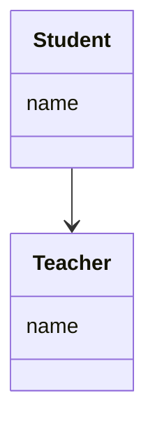
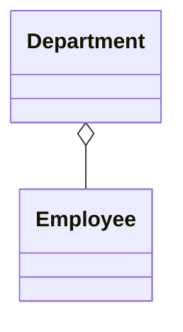
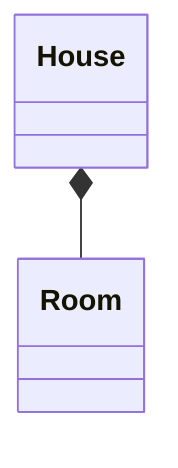
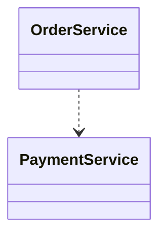
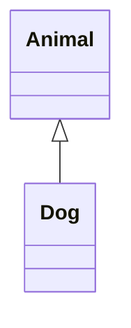
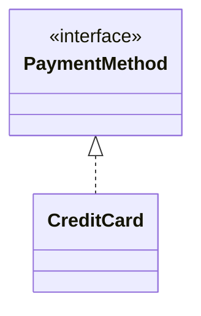
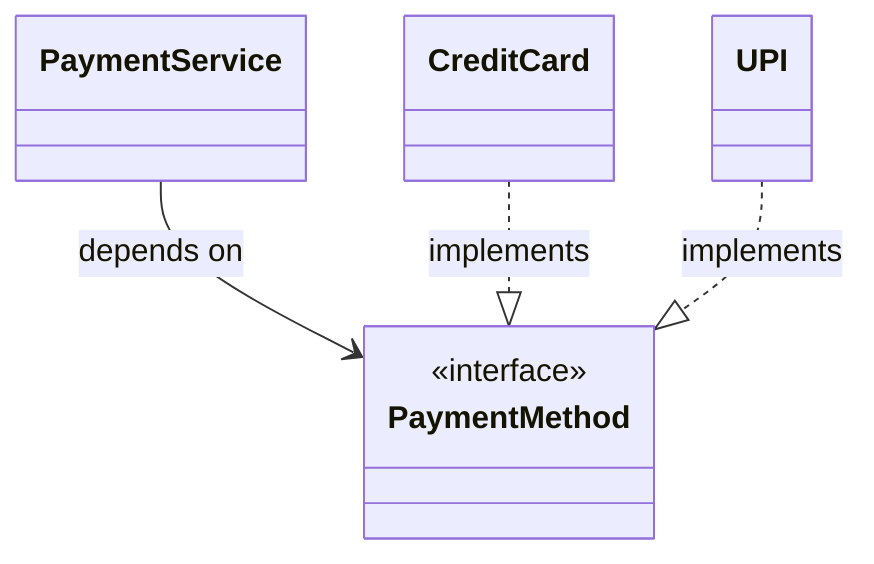

# 🌀 UML Relationships

In UML Class Diagrams, **relationships = how classes talk to each other**

There are mainly **6 types**:

| Type                         | Meaning                  | Strength |
| ---------------------------- | ------------------------ | -------- |
| Association                  | General connection       | ⭐        |
| Aggregation                  | Weak "has-a"             | ⭐⭐       |
| Composition                  | Strong "has-a"           | ⭐⭐⭐      |
| Dependency                   | Uses temporarily         | ⭐        |
| Inheritance (Generalization) | "is-a"                   | ⭐⭐⭐      |
| Realization                  | Interface implementation | ⭐⭐⭐      |

👉 UML defines relationships like association, dependency, generalization, realization etc. ([jsware.io][1])

## 🎯 2. ASSOCIATION (Most Common)

### 🔗 Meaning

Basic relationship → **one class knows another**

👉 Objects are independent
👉 No ownership

## 🧠 When to Use

* One class **has reference of another**
* Normal field / property

## 📊 Mermaid Diagram



## 💻 Code Example

```java
class Teacher {}

class Student {
    Teacher teacher; // association
}
```

### 🧠 Interview Line

> “Association represents a general connection where objects can exist independently.”

## 🎯 3. AGGREGATION (Weak Has-A)

### 🔗 Meaning

👉 Whole–part relationship
👉 BUT part can exist without whole

Example:

* Department → Employees

## 📊 Mermaid



👉 `o--` = hollow diamond (aggregation)

## 💻 Code

```java
class Employee {}

class Department {
    List<Employee> employees; // aggregation
}
```

## 🧠 Key Idea

* Employee exists even if department is deleted

## 🎯 4. COMPOSITION (Strong Has-A)

### 🔥 Meaning

👉 Strong ownership
👉 Child **cannot exist without parent**

Example:

* House → Room

## 📊 Mermaid



👉 `*--` = filled diamond (composition)

## 💻 Code

```java
class Room {}

class House {
    List<Room> rooms = new ArrayList<>();
}
```

## 🧠 Key Idea

* If House is destroyed → Rooms destroyed

👉 Strong lifecycle dependency ([go-minder.com][2])

## ⚡ 5. DEPENDENCY (Uses)

### 🔗 Meaning

👉 Temporary usage (method level)

* No field
* Just uses it

## 📊 Mermaid



👉 `..>` = dependency (dashed arrow)

## 💻 Code

```java
class PaymentService {}

class OrderService {
    void placeOrder(PaymentService payment) { // dependency
        payment.pay();
    }
}
```

## 🧠 When to Use

* Method parameter
* Local variable
* Utility usage

👉 Weakest relationship ([UMLBoard's Website][3])

## 🧬 6. INHERITANCE (Generalization)

## 🔗 Meaning

👉 "IS-A" relationship

Example:

* Dog is an Animal

## 📊 Mermaid



👉 `<|--` = inheritance

## 💻 Code

```java
class Animal {}

class Dog extends Animal {}
```

## 🧠 When to Use

* True subtype relationship
* Polymorphism needed

## 🔌 7. REALIZATION (Interface)

### 🔗 Meaning

👉 Class implements interface

## 📊 Mermaid



👉 `<|..` = realization (dashed inheritance)

## 💻 Code

```java
interface PaymentMethod {
    void pay();
}

class CreditCard implements PaymentMethod {
    public void pay() {}
}
```

### 🧠 When to Use

* Abstraction (DIP)
* Interface-based design

## 🧠 8. MOST IMPORTANT (Interview Cheat Sheet)

## 🔥 Difference Table

| Relation    | Arrow | Lifetime    | Example         |                |
| ----------- | ----- | ----------- | --------------- | -------------- |
| Association | `--`  | Independent | Student–Teacher |                |
| Aggregation | `o--` | Independent | Dept–Employee   |                |
| Composition | `*--` | Dependent   | House–Room      |                |
| Dependency  | `..>` | Temporary   | Service calls   |                |
| Inheritance | `<    | --`         | Strong          | Dog–Animal     |
| Realization | `<    | ..`         | Strong          | Impl interface |

## 🧠 9. HOW TO CHOOSE (Golden Rule)

### Ask these:

### ❓1. Is it "IS-A"?

→ Use **Inheritance**

### ❓2. Is it "HAS-A"?

Then ask:

* Strong ownership? → **Composition**
* Weak ownership? → **Aggregation**
* Just reference? → **Association**

### ❓3. Only using temporarily?

→ **Dependency**

### ❓4. Interface involved?

→ **Realization**

## 🔥 10. Real LLD Example (VERY IMPORTANT)

## Payment System



## Code

```java
interface PaymentMethod {
    void pay();
}

class CreditCard implements PaymentMethod {}
class UPI implements PaymentMethod {}

class PaymentService {
    private PaymentMethod method; // association

    PaymentService(PaymentMethod method) {
        this.method = method;
    }
}
```

## 🎯 Interview Explanation

> PaymentService depends on PaymentMethod via association, while concrete classes use realization. This enables polymorphism and decoupling.

### 🚀 Final Insight (VERY IMPORTANT)

👉 UML is not about drawing lines
👉 It’s about **expressing design decisions**

![[Drawing 2026-05-07 22.47.21.excalidraw]]

tags: #SystemDesign
