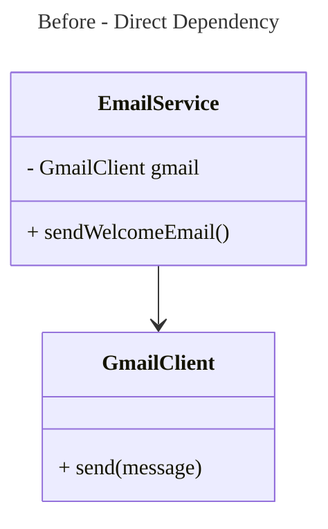
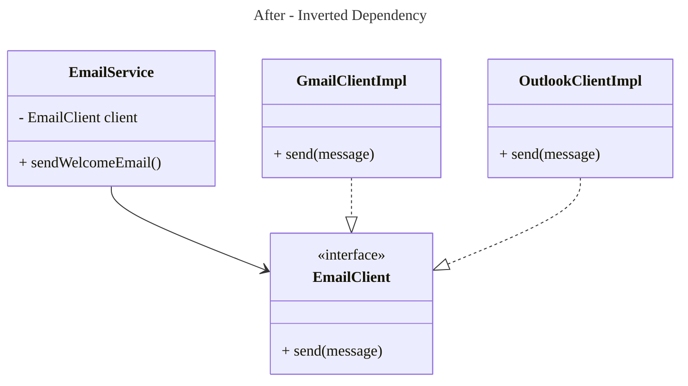

# 📦 Dependency Inversion Principle (DIP)

## 🚀 The Situation (Real Pain Every Developer Faces)

Have you ever tried to:

- Swap a database 🗄️
- Change an email provider 📧
- Replace a third-party API 🌐

…and suddenly realized:

> 💥 “I have to rewrite half my code just for this small change?”

Then you’ve already experienced a **violation of the Dependency Inversion Principle (DIP)**.

## 🧠 What’s Really Going Wrong?

Your **business logic is tightly coupled to implementation details**.

That means:

- Your **core logic depends on fragile things**
- Any small change → **big ripple effect**

👉 This is exactly what DIP solves.

# ❌ 1. The Problem — Tightly Coupled Design

## 🧱 Scenario: Email Service (Bad Design)

You start simple:

- “Let’s send emails using Gmail”

So you write:

```java
class GmailClient {
    void send(String message) {
        // Gmail API call
    }
}

class EmailService {
    private GmailClient gmail = new GmailClient();

    void sendWelcomeEmail() {
        gmail.send("Welcome!");
    }
}
```

## 📉 Dependency Graph (Before DIP)



## 🚨 Why This Fails in Real Life

Now product says:

> “Switch from Gmail to Outlook”

You must:

- ❌ Modify EmailService
- ❌ Replace Gmail logic everywhere
- ❌ Break tests
- ❌ Add messy if-else logic

## 💣 Scaling Problem

Now imagine:

- Gmail
- Outlook
- AWS SES

👉 You end up with:

```java
if(provider == "gmail") ...
else if(provider == "outlook") ...
else if(provider == "ses") ...
```

👉 ❌ This is NOT scalable design

# 🔥 2. The Principle — What DIP Actually Says

According to **Robert C. Martin**:

> High-level modules should not depend on low-level modules.
> Both should depend on abstractions. ([GeeksforGeeks][1])

## 🧠 Simple Translation

- Business logic ❌ should NOT depend on Gmail/DB/API
- Instead → depend on **interface (contract)**

## 🔄 What Gets “Inverted”?

👉 Not control flow
👉 **Dependency direction**

# ✅ 3. The Solution — Apply DIP

## Step 1: Define Abstraction (Contract)

```java
interface EmailClient {
    void send(String message);
}
```

## Step 2: Implement Details

```java
class GmailClient implements EmailClient {
    public void send(String message) {
        // Gmail logic
    }
}

class OutlookClient implements EmailClient {
    public void send(String message) {
        // Outlook logic
    }
}
```

## Step 3: High-Level Uses Abstraction

```java
class EmailService {
    private EmailClient client;

    EmailService(EmailClient client) {
        this.client = client;
    }

    void sendWelcomeEmail() {
        client.send("Welcome!");
    }
}
```

## Step 4: Inject Dependency

```java
EmailClient client = new GmailClient();
EmailService service = new EmailService(client);
```

# 📈 Dependency Graph (After DIP)



# 💡 4. What Just Happened (Core Insight)

👉 Before:

- EmailService → Gmail (tight coupling)

👉 After:

- EmailService → Interface ← Gmail/Outlook

## 🧠 Golden Rule

> 💡 “Depend on WHAT, not HOW”

# 🚀 5. Why DIP Matters (Real Engineering Value)

### 🔓 Decoupling

Business logic independent of external systems

### 🔁 Flexibility

Switch providers without touching core code

### 🧪 Testability

Mock EmailClient easily

### 🛠️ Maintainability

Changes are localized

### 👥 Parallel Development

Teams can work independently

👉 DIP reduces tight coupling and improves maintainability ([GeeksforGeeks][1])

# 🧠 6. Deep Understanding (Senior-Level Thinking)

## 🔥 Policy vs Detail

| Type   | Example      |
| ------ | ------------ |
| Policy | EmailService |
| Detail | GmailClient  |

👉 Policy should NOT depend on detail

## 🔥 Stable vs Unstable

- Interface → stable
- Implementation → changes often

👉 Depend on stable things

## 🔥 Compile-time vs Runtime

| Type         | Dependency     |
| ------------ | -------------- |
| Compile-time | Interface      |
| Runtime      | Implementation |

# ⚠️ 7. Common Mistakes (Interview Traps)

## ❌ 1. Over-Abstraction

```java
interface Logger {}
interface MathHelper {}
```

👉 Don’t create interfaces blindly

## ❌ 2. Leaky Abstraction

```java
interface EmailClient {
    void configureGmailSettings(); // ❌ WRONG
}
```

👉 Interface should NOT know implementation

## ❌ 3. Wrong Ownership

- ❌ Interface inside Gmail module
- ✅ Interface owned by service layer

## ❌ 4. Fake DIP

```java
class EmailService {
    private EmailClient client = new GmailClient(); // ❌ still coupled
}
```

👉 No real inversion

# 🔗 8. DIP vs DI vs IoC

| Concept | Meaning        |
| ------- | -------------- |
| DIP     | Principle      |
| DI      | Technique      |
| IoC     | Bigger concept |

## 🧠 Key Insight

- DIP = “Design rule”
- DI = “How you implement it”

# 🧪 9. How to Detect DIP Violation

Ask yourself:

- ❓ Using `new` inside service?
- ❓ Business logic depends on DB/API?
- ❓ Hardcoded dependency?

👉 If YES → DIP violation

# 🏁 10. Final Insight (Most Important)

> 🚀 DIP is NOT about interfaces
> 👉 It is about **controlling change in your system**

# 🛠️ Practice (Must for Interview)

Build using DIP:

- Payment system (Stripe vs Razorpay)
- Auth system (JWT vs OAuth)
- Notification system (Email vs SMS)

# 🎯 Perfect Interview Answer

> “Dependency Inversion Principle ensures that high-level business logic is decoupled from low-level implementation details by making both depend on abstractions. This inversion of dependency improves flexibility, testability, and maintainability.”
