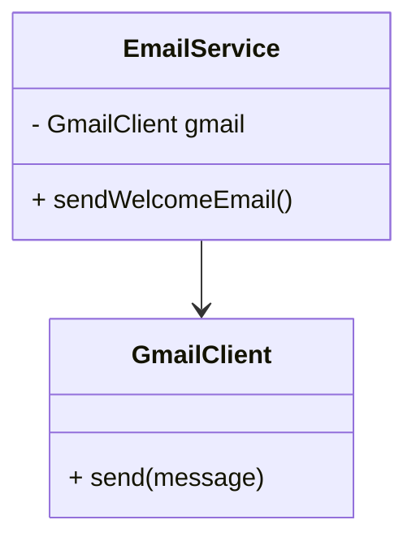
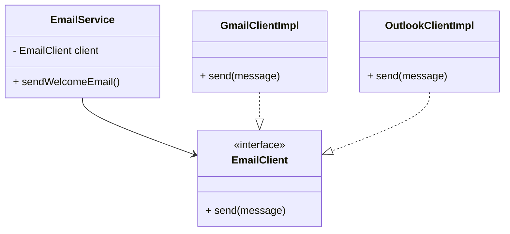

# 📦 Dependency Inversion Principle (DIP)

## 🚀 The Real Problem Developers Face

At some point in your development journey, you will encounter a frustrating situation:

- You try to switch a database
- You replace an email provider
- You integrate a new third-party API

What seemed like a small change suddenly forces you to modify large parts of your codebase.

> A simple change turns into a costly refactor.

This is not just bad luck — it is usually a design problem. More specifically, it is a violation of the **Dependency Inversion Principle (DIP)**.

## 🧠 What Is Actually Going Wrong?

The root issue is **tight coupling**.

Your business logic depends directly on implementation details such as:

- Database clients
- External APIs
- Third-party services

This creates a fragile system where:

- Changes ripple through multiple layers
- Testing becomes difficult
- Extending the system becomes risky

The Dependency Inversion Principle exists to solve exactly this problem by reducing coupling and improving flexibility ([GeeksforGeeks][1])

# ❌ 1. The Problem: A Tightly Coupled Design

## 🧱 Example: Email Service

You start with a simple requirement: send emails using Gmail.

```java
class GmailClient {
    void send(String message) {
        // Gmail API call
    }
}

class EmailService {
    private GmailClient gmail = new GmailClient();

    void sendWelcomeEmail() {
        gmail.send("Welcome!");
    }
}
```

At first, this looks fine. The code is simple and works correctly.

## 📉 Dependency Structure (Before DIP)



## 🚨 Why This Design Fails

Now imagine a new requirement:

> “We need to switch from Gmail to Outlook.”

This change forces you to:

- Modify `EmailService`
- Replace all Gmail-specific logic
- Update constructors and dependencies
- Potentially introduce conditional logic

If you support multiple providers, the code quickly becomes difficult to maintain:

```java
if(provider == "gmail") ...
else if(provider == "outlook") ...
else if(provider == "ses") ...
```

This approach does not scale and leads to brittle architecture.

# 🔥 2. The Dependency Inversion Principle

The Dependency Inversion Principle states:

> High-level modules should not depend on low-level modules. Both should depend on abstractions.
> Abstractions should not depend on details. Details should depend on abstractions ([GeeksforGeeks][1])

## 🧠 Interpreting the Principle

- High-level modules = business logic
- Low-level modules = implementation details
- Abstractions = interfaces or contracts

In simple terms:

> Business logic should depend on **what needs to be done**, not **how it is done**.

## 🔄 What Does “Inversion” Mean?

Traditionally:

```
High-level → Low-level
```

With DIP:

```
High-level → Abstraction ← Low-level
```

The dependency direction is inverted by introducing an abstraction layer.

# ✅ 3. Applying DIP Step by Step

## Step 1: Define an Abstraction

```java
interface EmailClient {
    void send(String message);
}
```

## Step 2: Implement Concrete Classes

```java
class GmailClient implements EmailClient {
    public void send(String message) {
        // Gmail logic
    }
}

class OutlookClient implements EmailClient {
    public void send(String message) {
        // Outlook logic
    }
}
```

## Step 3: Use Abstraction in Business Logic

```java
class EmailService {
    private EmailClient client;

    EmailService(EmailClient client) {
        this.client = client;
    }

    void sendWelcomeEmail() {
        client.send("Welcome!");
    }
}
```

## Step 4: Inject the Dependency

```java
EmailClient client = new GmailClient();
EmailService service = new EmailService(client);
```

# 📈 Dependency Structure (After DIP)



# 💡 What Changed?

Before:

- `EmailService` depended on a concrete implementation (`GmailClient`)

After:

- `EmailService` depends only on an abstraction (`EmailClient`)
- Concrete implementations depend on the abstraction

This decouples business logic from implementation details.

## 🧠 Key Insight

> Depend on **what the system needs**, not **how it is implemented**

# 🚀 Why DIP Matters

Applying DIP provides several important benefits:

### Decoupling

>Business logic is no longer tied to specific implementations.

### Flexibility

>You can switch providers without modifying core logic.

### Testability

>Mock implementations can be injected for testing.

### Maintainability

>Changes remain localized to specific components.

### Scalability

>New implementations can be added without modifying existing code. DIP enables flexible and maintainable systems by reducing tight coupling

# 🧠 Deeper Understanding

## Policy vs Detail

| Type   | Example      |
| ------ | ------------ |
| Policy | EmailService |
| Detail | GmailClient  |

Business rules (policy) should not depend on implementation (detail).

## Stable vs Changing Components

- Interfaces → stable
- Implementations → change frequently

Design should depend on stable components.

## Compile-Time vs Runtime

| Phase        | Dependency     |
| ------------ | -------------- |
| Compile-time | Interface      |
| Runtime      | Implementation |

# ⚠️ Common Mistakes

## Over-Abstraction

Creating interfaces unnecessarily adds complexity without real benefit.

## Leaky Abstractions

```java
interface EmailClient {
    void configureGmailSettings(); // Incorrect
}
```

Interfaces should not expose implementation-specific behavior.

## Incorrect Ownership

Interfaces should belong to the high-level module, not the low-level implementation.

## Fake Dependency Inversion

```java
class EmailService {
    private EmailClient client = new GmailClient(); // Still coupled
}
```

Creating the dependency inside the class defeats the purpose.

# 🔗 DIP vs Related Concepts

| Concept | Description                       |
| ------- | --------------------------------- |
| DIP     | Design principle                  |
| DI      | Technique to inject dependencies  |
| IoC     | Broader control inversion concept |

# 🧪 How to Identify a DIP Violation

Ask the following:

- Is business logic directly using a database or API?
- Is a concrete class instantiated inside another class?
- Is the system hard to modify when implementations change?

If yes, DIP is likely being violated.

# 🚩 Final Thought

The Dependency Inversion Principle is often misunderstood as simply “using interfaces.”

That is not the real goal.

> The real purpose of DIP is to **control how change propagates through your system**.

When applied correctly, it allows you to evolve your system without constantly rewriting core logic.

# 🎯 Interview Summary

> The Dependency Inversion Principle ensures that high-level business logic does not depend on low-level implementation details. Instead, both depend on abstractions, making the system more flexible, testable, and maintainable.
