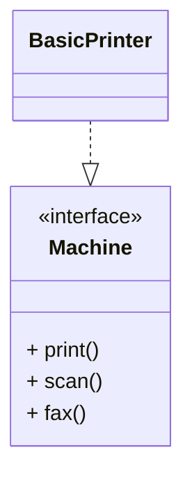
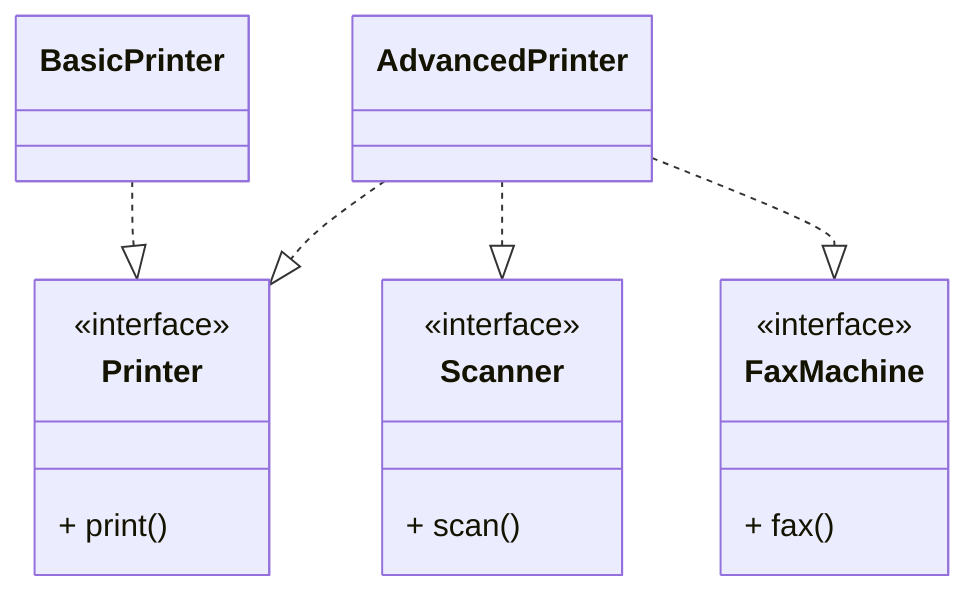
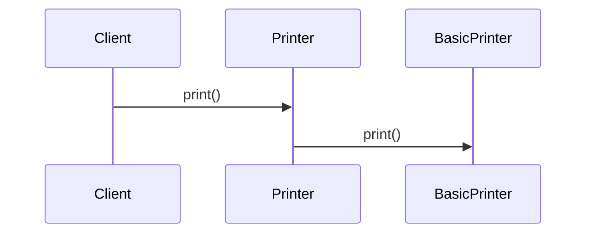

# 📦 Interface Segregation Principle (ISP)

## 🚀 The Real Problem Developers Face

You design a “smart” interface.

It looks powerful.

It has:

* Print functionality
* Scan functionality
* Fax functionality
* Copy functionality

Everything is grouped into one big interface because:

> “All printers should support these features.”

At first, this feels convenient.

But then…

You build a simple printer that only prints.

Suddenly:

* You are forced to implement `scan()`
* Forced to implement `fax()`
* Forced to implement `copy()`

Even though the device cannot perform those operations.

So what happens?

Developers start writing:

```java id="9gg2gd"
throw new UnsupportedOperationException();
```

or

```java id="tv53n4"
// do nothing
```

> Your design is now forcing classes to depend on methods they do not use.

This is exactly the problem the **Interface Segregation Principle (ISP)** solves.

# 🧠 What Is Actually Going Wrong?

The issue is:

> ❗ Interfaces became too large and generic

This creates:

* Unnecessary coupling
* Fake implementations
* Fragile systems
* Confusing APIs

# ❌ 1. The Problem — Fat Interfaces

## 🧱 Example: Multi-Function Printer

```java id="e8fz0t"
interface Machine {
    void print();
    void scan();
    void fax();
}
```

Now:

```java id="t2p8s6"
class BasicPrinter implements Machine {

    public void print() {
        System.out.println("Printing...");
    }

    public void scan() {
        throw new UnsupportedOperationException();
    }

    public void fax() {
        throw new UnsupportedOperationException();
    }
}
```

## 📉 Dependency Structure (Before ISP)



## 🧠 Explanation

BasicPrinter implements the Machine interface using realization, meaning it must provide implementations for all methods defined in the interface. However, BasicPrinter only supports printing behavior and is forced to implement scan() and fax() methods that it does not actually use.

This creates unnecessary coupling between the class and unrelated behaviors. The interface has become too broad, forcing clients to depend on methods they neither need nor support. As a result, the design becomes fragile and leads to fake implementations or runtime exceptions.

This violates the Interface Segregation Principle because clients should not be forced to depend on functionality they do not require. ([Wikipedia][1])

## 🚨 Why This Design Fails

Now imagine:

* A thermal printer
* A receipt printer
* A cloud printer

Most of them:

* Cannot fax
* Cannot scan

Yet all are forced to implement unnecessary methods.

## 💣 Real Problem

The interface is trying to represent:

> “Everything a machine could possibly do”

Instead of:

> “What a specific client actually needs”

# 🔥 2. The Interface Segregation Principle

The Interface Segregation Principle states:

> Clients should not be forced to depend upon interfaces that they do not use. ([Wikipedia][1])

## 🧠 Simple Interpretation

Instead of:

```text id="jlwmxw"
One huge interface
```

Prefer:

```text id="6fc0ma"
Multiple small, focused interfaces
```

## 🔄 Key Idea

> Many client-specific interfaces are better than one general-purpose interface. ([anasdidi.dev][2])

# ✅ 3. Applying ISP Step by Step

## Step 1: Split Responsibilities

```java id="v1j0sk"
interface Printer {
    void print();
}

interface Scanner {
    void scan();
}

interface FaxMachine {
    void fax();
}
```

## Step 2: Implement Only What Is Needed

### Basic Printer

```java id="33r1ib"
class BasicPrinter implements Printer {

    public void print() {
        System.out.println("Printing...");
    }
}
```

### Advanced Printer

```java id="rd4n3m"
class AdvancedPrinter implements Printer, Scanner, FaxMachine {

    public void print() {
        System.out.println("Printing...");
    }

    public void scan() {
        System.out.println("Scanning...");
    }

    public void fax() {
        System.out.println("Faxing...");
    }
}
```

# 📈 Dependency Structure (After ISP)



# 🧠 Explanation

Printer, Scanner, and FaxMachine represent small, focused interfaces, each responsible for a single capability. BasicPrinter implements only the Printer interface because it only supports printing functionality. AdvancedPrinter implements multiple interfaces because it supports multiple capabilities.

The realization relationships (`..|>`) show that classes implement only the contracts they actually need. This prevents unnecessary dependencies and avoids forcing clients to implement irrelevant methods.

This design improves flexibility, reduces coupling, and keeps interfaces highly cohesive. Classes now depend only on behaviors they truly require, which is the core idea behind the Interface Segregation Principle. ([Wikipedia][1])

# 🔄 Runtime Flow



# 💡 What Changed?

Before:

* One large interface
* Forced implementations
* Unused dependencies

After:

* Small focused interfaces
* Clean contracts
* Only necessary behavior implemented

# 🚀 Why ISP Matters

### Reduced Coupling

Classes depend only on relevant methods

### Better Maintainability

Changes remain isolated

### Cleaner APIs

Interfaces become easier to understand

### Better Flexibility

Different implementations support different capabilities

### Safer Design

No fake methods or runtime exceptions

# 🧠 Deep Understanding (Senior-Level Thinking)

## 🔥 ISP Is About Clients

This is the most important insight.

The principle says:

> Design interfaces around client needs

NOT around:

> “Everything the system can do”

## 🔥 Fat Interfaces Are Dangerous

Large interfaces often indicate:

* Multiple responsibilities
* Poor abstraction
* Tight coupling

## 🔥 ISP and SRP Are Related

| Principle | Focus                            |
| --------- | -------------------------------- |
| SRP       | One responsibility per class     |
| ISP       | One responsibility per interface |

# ⚠️ Common Mistakes (Interview Traps)

## ❌ 1. “Universal” Interfaces

```java id="fdkpc4"
interface SmartDevice {
    print();
    scan();
    fax();
    playMusic();
    makeCoffee();
}
```

## ❌ 2. Empty Implementations

```java id="7q3m4k"
void fax() {
   // do nothing
}
```

👉 Huge red flag

## ❌ 3. Throwing Unsupported Exceptions

```java id="2ayf3r"
throw new UnsupportedOperationException();
```

👉 Usually indicates ISP violation

## ❌ 4. Confusing ISP with SRP

ISP focuses specifically on:

> Interface design and client dependency

# 🧪 How to Detect ISP Violation

Ask:

* Are classes implementing unused methods?
* Are there empty implementations?
* Are exceptions thrown because functionality is unsupported?
* Is the interface too broad?

👉 If YES → ISP violation

# 🔗 Relation to Other Principles

| Principle | Role                     |
| --------- | ------------------------ |
| SRP       | Single responsibility    |
| ISP       | Small focused interfaces |
| DIP       | Depend on abstractions   |

# 🏁 Final Thought

The Interface Segregation Principle is not about creating many interfaces for the sake of it.

It is about:

> Designing interfaces that are focused, cohesive, and client-specific

# 🎯 Interview Summary

> The Interface Segregation Principle states that clients should not be forced to depend on methods they do not use. It encourages small, focused interfaces instead of large, generic ones, improving maintainability and reducing unnecessary coupling. ([Wikipedia][1])

# 🔥 Bonus Interview Questions

### ❓ Q1: How is ISP different from SRP?

👉 SRP applies to classes
👉 ISP applies to interfaces

### ❓ Q2: What is a “fat interface”?

👉 An interface with too many unrelated methods

### ❓ Q3: Biggest sign of ISP violation?

👉 `UnsupportedOperationException`

### ❓ Q4: Can ISP improve testability?

👉 Yes — smaller interfaces are easier to mock

# 🚀 Final One-Line Memory

> “Clients should only know what they actually need.”
