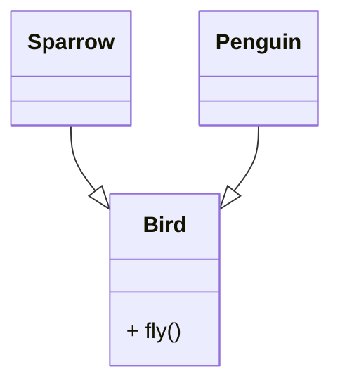
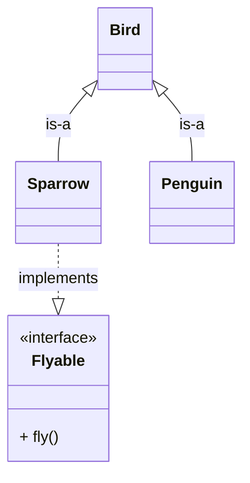
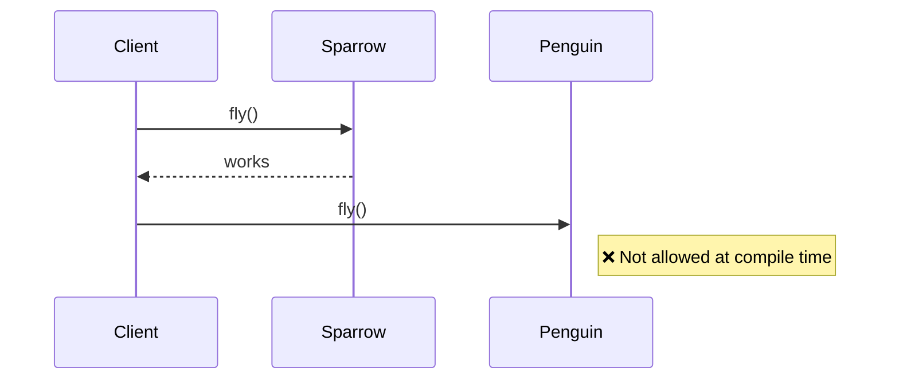

# 📦 Liskov Substitution Principle (LSP)

## 🌀 What Is LSP?

```text
LSP states that a subclass should behave in such a way that it can replace its parent class without breaking the program.
```

## 🚀 The Real Problem Developers Face

You design a clean system using inheritance:

- Base class works perfectly
- Child class extends it

Everything compiles. No errors.

But at runtime…

> 💥 The system behaves incorrectly

Why?

Because:

- The child class **changed behavior**
- The system **trusted the parent contract**

👉 This is where **LSP comes in**

## 🧠 What Is Actually Going Wrong?

The problem is not inheritance itself.

The problem is:

> ❗ The child class is **not behaving like the parent**

## ❌ 1. The Problem — “Looks Like a Duck, Acts Like a Cat”

## 🧱 Classic Example: Bird System

```java
class Bird {
    void fly() {
        // flying logic
    }
}

class Sparrow extends Bird {
    void fly() {
        // works fine
    }
}

class Penguin extends Bird {
    void fly() {
        throw new Error("Cannot fly");
    }
}
```

## 🚨 What Happens?

```java
void makeBirdFly(Bird bird) {
    bird.fly();
}
```

Now:

```java
makeBirdFly(new Penguin()); // 💥 runtime failure
```

## 📉 Problem Diagram



## 💣 Why This Fails

- Code expects: **all Birds can fly**
- Penguin breaks that assumption

👉 System becomes **unpredictable**

## 🔥 2. The Principle — What LSP Actually Says

> Objects of a superclass should be replaceable with objects of a subclass **without breaking the program**

## 🧠 Simple Interpretation

> If child extends parent → it must behave like parent

## 🔄 Key Idea

```text
If S is subtype of T,
then S should be usable anywhere T is used
```

👉 Without errors
👉 Without surprises

## ✅ 3. Fixing the Design (Step-by-Step)

## Step 1: Identify Wrong Abstraction

👉 Problem:

- “Bird” assumes flying
- But not all birds fly

## Step 2: Separate Behavior

```java
class Bird {
    // common behavior
}

interface Flyable {
    void fly();
}
```

## Step 3: Correct Modeling

```java
class Sparrow extends Bird implements Flyable {
    public void fly() {
        // flying logic
    }
}

class Penguin extends Bird {
    // no fly method
}
```

## 📈 Fixed Design Diagram



## 🔄 Runtime Flow (Correct Behavior)



## 💡 What Changed?

Before:

- Wrong assumption in parent
- Child breaks behavior

After:

- Correct abstraction
- No invalid substitution

## 🧠 Core Insight (VERY IMPORTANT)

> LSP is about **behavior**, not just structure

### ⚠️ Key Rule

> Subclass must honor the **contract** of parent

That includes:

- Method behavior
- Input expectations
- Output guarantees

## 🚀 Why LSP Matters

### Predictability

System behaves consistently

### Safe Polymorphism

No runtime surprises

### Strong Design

Inheritance hierarchy stays valid

### Maintainability

Less hidden bugs

## 🧠 Deep Understanding (Senior-Level)

## 🔥 Behavior vs Structure

| Type      | Meaning                |
| --------- | ---------------------- |
| Structure | Method exists          |
| Behavior  | Method works correctly |

👉 LSP is about **behavior**

## 🔥 Contract Rules (Very Important)

From theory:

- Don’t strengthen input conditions
- Don’t weaken output guarantees
- Maintain invariants

## 🔥 Real Insight

> Inheritance is NOT about code reuse
> It is about **behavior compatibility**

## ⚠️ Common Mistakes (Interview Traps)

### ❌ 1. Rectangle–Square Problem

```java
class Rectangle {
    setWidth()
    setHeight()
}

class Square extends Rectangle {
    setWidth() {
        height = width; // breaks expectation
    }
}
```

👉 Breaks expected behavior
👉 Violates LSP

## ❌ 2. Throwing Exceptions

```java
class Child extends Parent {
    method() {
        throw new Error(); // ❌
    }
}
```

## ❌ 3. Changing Input Rules

Parent:

```java
accepts any number
```

Child:

```java
accepts only 1–100 ❌
```

👉 Breaks substitution

## 🧪 How to Detect LSP Violation

Ask:

- Can I replace parent with child safely?
- Will behavior remain correct?
- Any hidden exceptions?

👉 If NO → LSP violation

## 🔗 Relation to Other Principles

| Principle | Role                            |
| --------- | ------------------------------- |
| OCP       | Extend behavior                 |
| LSP       | Ensure correctness of extension |
| DIP       | Decouple dependencies           |

## 🏁 Final Thought

LSP is often misunderstood as:

> “Just inheritance rule”

That’s wrong.

> It is a **behavioral guarantee** in your system

## 🎯 Interview Summary

> The Liskov Substitution Principle states that subclasses must be substitutable for their base classes without altering the correctness of the program. It ensures that inheritance preserves behavior, not just structure.

## 🔥 Bonus Interview Questions

### ❓ Q1: Why is LSP important for polymorphism?

👉 Because polymorphism depends on **safe substitution**

### ❓ Q2: Can code compile but still violate LSP?

👉 YES — LSP is runtime behavior

### ❓ Q3: LSP vs OCP?

👉 OCP → extend
👉 LSP → ensure extension is correct

### ❓ Q4: Best way to avoid LSP violation?

👉 Prefer **composition over inheritance**

### 🚀 Final One-Line Memory

> “If it breaks when you replace it — it violates LSP”
