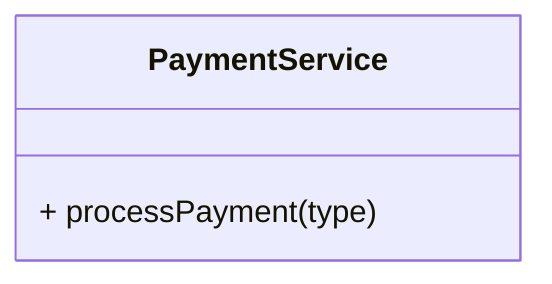
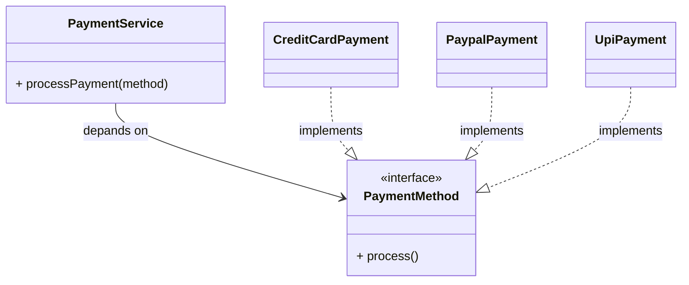
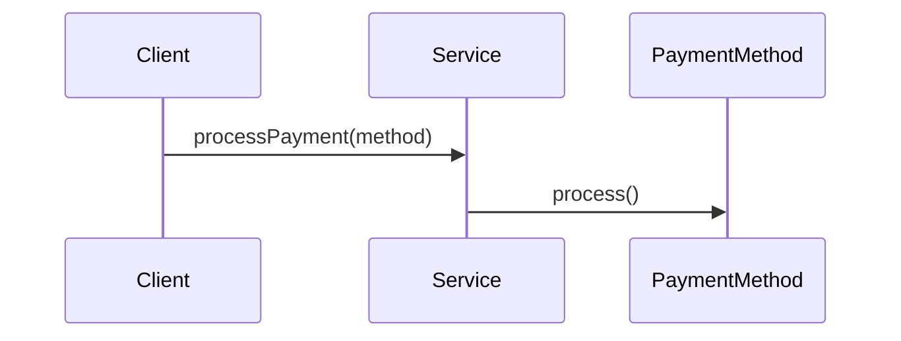

# 📦 Open/Closed Principle (OCP)

## 🚀 The Real Problem Developers Face

You build a feature. It works well.

Later, new requirements arrive:

* Add a new payment method
* Support a new notification channel
* Introduce a new discount type

You open your existing class, modify logic, add conditions, and redeploy.

It works… until the next requirement comes.

Then again:

* Modify the same class
* Add more conditions
* Risk breaking existing functionality

> Over time, your code becomes fragile and harder to maintain.

This is a classic violation of the **Open/Closed Principle (OCP)**.

## 🧠 What Is Actually Going Wrong?

The issue is simple:

> Your system is **not designed for extension**, only for modification.

Every new feature forces you to:

* Change existing, stable code
* Introduce risk
* Break previously working behavior

## ❌ 1. The Problem: Conditional Explosion

### 🧱 Example: Payment Processor (Bad Design)

```java
class PaymentService {

    void processPayment(String type) {
        if (type.equals("credit_card")) {
            // process credit card
        } else if (type.equals("paypal")) {
            // process PayPal
        } else if (type.equals("upi")) {
            // process UPI
        }
    }
}
```

### 📉 Dependency Structure (Before OCP)



### 🚨 Why This Design Fails

Now a new requirement comes:

> “Add support for Apple Pay”

What do you do?

* Modify `PaymentService`
* Add another `if-else`
* Retest everything

## 💣 Scaling Problem

As features grow:

```java
if(type == "credit_card") ...
else if(type == "paypal") ...
else if(type == "upi") ...
else if(type == "apple_pay") ...
else if(type == "crypto") ...
```

Problems:

* Code becomes harder to read
* Risk of breaking existing logic
* Violates maintainability

## 🔥 2. The Open/Closed Principle

The Open/Closed Principle states:

> Software entities should be **open for extension but closed for modification**

### 🧠 Simple Interpretation

* You should be able to **add new behavior**
* Without **changing existing code**

### 🔄 Key Idea

> Add new features by **adding new code**, not modifying old code

## ✅ 3. Applying OCP Step by Step

### Step 1: Identify What Changes

In our example:

* Payment types change frequently

👉 This is the variation point

### Step 2: Introduce Abstraction

```java
interface PaymentMethod {
    void process();
}
```

### Step 3: Create Concrete Implementations

```java
class CreditCardPayment implements PaymentMethod {
    public void process() {
        // credit card logic
    }
}

class PaypalPayment implements PaymentMethod {
    public void process() {
        // PayPal logic
    }
}

class UpiPayment implements PaymentMethod {
    public void process() {
        // UPI logic
    }
}
```

## Step 4: Update Service to Use Abstraction

```java
class PaymentService {

    void processPayment(PaymentMethod method) {
        method.process();
    }
}
```

## 📈 Dependency Structure (After OCP)



## 🔄 Runtime Flow (Sequence Diagram)



### 💡 What Changed?

Before:

* Adding a new payment type → modify existing class

After:

* Adding a new payment type → create new class

### 🧠 Core Insight

> Stable code should not be modified for every new requirement

## 🚀 Why OCP Matters

### Stability

Existing code remains untouched

### Extensibility

New features can be added easily

### Reduced Risk

Less chance of breaking existing functionality

### Scalability

System grows without becoming messy

## 🧠 Deep Understanding (Senior-Level Thinking)

## Variation Points

Identify:

> What part of the system changes frequently?

That part should be **abstracted**

## Polymorphism Over Conditionals

Instead of:

```java
if(type == ...)
```

Use:

```java
method.process()
```

## Strategy Pattern Connection

OCP is often implemented using:

* Strategy Pattern
* Factory Pattern
* Plugin architecture

## ⚠️ Common Mistakes

### ❌ Over-Abstraction

Creating abstractions without real variation

### ❌ Premature Generalization

Designing for problems that don’t exist yet

### ❌ Using Enums Instead of Polymorphism

```java
switch(type) { ... }
```

👉 Still violates OCP

## ❌ Modifying Base Class Frequently

If base class keeps changing → OCP not achieved

## 🧪 How to Detect OCP Violation

Ask:

* Do I modify existing code for every new feature?
* Do I use `if-else` or `switch` for behavior changes?
* Is adding a feature risky?

👉 If YES → OCP violation

### 🔗 Relation to Other Principles

| Principle | Role                   |
| --------- | ---------------------- |
| SRP       | Defines responsibility |
| OCP       | Enables extension      |
| DIP       | Decouples dependencies |

## 🏁 Final Thought

The Open/Closed Principle is not about avoiding changes entirely.

It is about:

> Designing systems where **change happens through extension, not modification**

## 🎯 Interview Summary

> The Open/Closed Principle states that software components should be open for extension but closed for modification. This allows new features to be added without changing existing, stable code, improving maintainability and reducing risk.

## 🔥 Bonus Interview Questions

### ❓ Q1: How do you achieve OCP?

👉 Using abstraction and polymorphism

### ❓ Q2: Is OCP always necessary?

👉 No — apply where change is expected

### ❓ Q3: OCP vs SRP?

👉 SRP = one responsibility
👉 OCP = extend without modifying

### ❓ Q4: Can inheritance break OCP?

👉 Yes, if base class keeps changing
