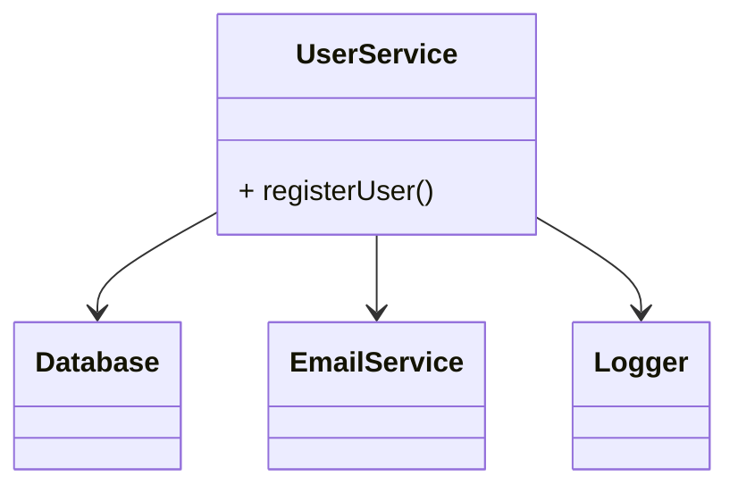
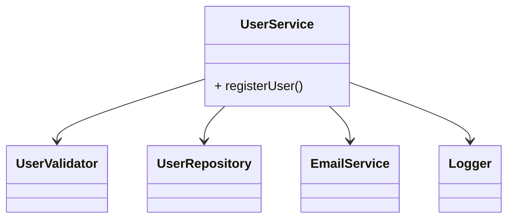
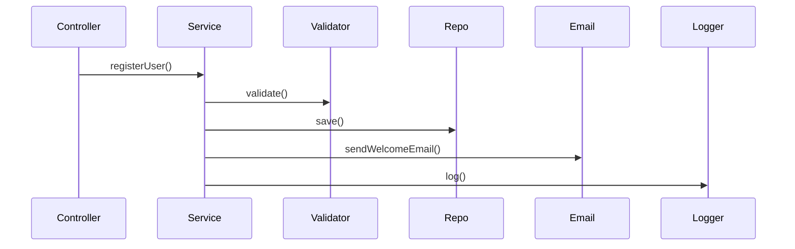

# 📦Single Responsibility Principle (SRP)

## 🚀 The Real Problem Developers Face

Imagine you are building a feature.

You start with a simple class. Over time, you keep adding:

* Business logic
* Database calls
* Validation
* Logging
* Email sending

Everything works. The class grows.

Then one day:

* A validation rule changes
* The database schema updates
* Logging format needs modification

Suddenly, you are modifying the **same class again and again**.

> A single change starts affecting multiple unrelated parts of the system.

This is not just bad design — it is a violation of the **Single Responsibility Principle (SRP)**.

## 🧠 What Is Actually Going Wrong?

The issue is not complexity alone.

The issue is:

> ❗ One class is handling multiple responsibilities

This leads to:

* Frequent changes
* High risk of breaking unrelated logic
* Difficult testing
* Low reusability

The Single Responsibility Principle addresses this by enforcing clear separation of concerns.

# ❌ 1. The Problem: A “God Class”

## 🧱 Example: User Service (Bad Design)

```java
class UserService {

    void registerUser(User user) {
        // 1. Validate user
        if (user.email.isEmpty()) {
            throw new Error("Invalid email");
        }

        // 2. Save to database
        Database.save(user);

        // 3. Send email
        EmailService.sendWelcomeEmail(user.email);

        // 4. Log action
        Logger.log("User registered");
    }
}
```

## 📉 Dependency Structure (Before SRP)



## 🚨 Why This Design Fails

At first, it looks convenient.

But now consider changes:

| Change                  | Impact             |
| ----------------------- | ------------------ |
| Validation rules change | Modify UserService |
| Database changes        | Modify UserService |
| Email logic changes     | Modify UserService |
| Logging format changes  | Modify UserService |

👉 One class has **multiple reasons to change**

This directly violates SRP.

# 🔥 2. The Principle — What SRP Actually Says

The Single Responsibility Principle states:

> A class should have only one reason to change ([Wikipedia][1])

Or more practically:

> A module should handle **one responsibility or one role** in the system ([TechTarget][2])

## 🧠 Simple Interpretation

* One class → one job
* One job → one reason to change

## 🔄 Key Insight

> If a class changes for multiple reasons, it has multiple responsibilities

# ✅ 3. Applying SRP Step by Step

## Step 1: Identify Responsibilities

From the original class:

* Validation
* Persistence
* Email sending
* Logging

👉 These are **different responsibilities**

## Step 2: Split Responsibilities

### Validation

```java
class UserValidator {
    void validate(User user) {
        if (user.email.isEmpty()) {
            throw new Error("Invalid email");
        }
    }
}
```

### Repository

```java
class UserRepository {
    void save(User user) {
        Database.save(user);
    }
}
```

### Email Service

```java
class EmailService {
    void sendWelcomeEmail(String email) {
        // send email
    }
}
```

### Logger

```java
class Logger {
    void log(String message) {
        // logging
    }
}
```

## Step 3: Orchestrate in Service

```java
class UserService {

    private UserValidator validator;
    private UserRepository repo;
    private EmailService emailService;
    private Logger logger;

    UserService(UserValidator validator,
                UserRepository repo,
                EmailService emailService,
                Logger logger) {
        this.validator = validator;
        this.repo = repo;
        this.emailService = emailService;
        this.logger = logger;
    }

    void registerUser(User user) {
        validator.validate(user);
        repo.save(user);
        emailService.sendWelcomeEmail(user.email);
        logger.log("User registered");
    }
}
```

# 📈 Dependency Structure (After SRP)



# 🔄 Runtime Flow (Sequence Diagram)



# 💡 What Changed?

Before:

* One class handled everything
* Multiple reasons to change

After:

* Each class has a single responsibility
* Changes are isolated

## 🧠 Core Insight

> Separate things that change for different reasons ([TechTarget][3])

# 🚀 Why SRP Matters

### Maintainability

Changes affect only one component

### Testability

Each class can be tested independently

### Reusability

Components can be reused in other parts

### Readability

Code becomes easier to understand

### Reduced Coupling

Responsibilities are clearly separated

# 🧠 Deep Understanding (Senior-Level Thinking)

## Responsibility = Reason to Change

This is the most important concept.

* Validation changes → Validator
* DB changes → Repository
* Email changes → EmailService

👉 Each class reacts to **one type of change**

## Cohesion

High cohesion = class does one thing well

Low cohesion = class does many unrelated things

# ⚠️ Common Mistakes

## ❌ Over-Splitting

Creating too many tiny classes:

```java
UserEmailValidator
UserPasswordValidator
UserNameValidator
```

👉 This leads to unnecessary complexity

## ❌ Misunderstanding Responsibility

Responsibility is not “method-level”

It is about **business role**

## ❌ God Classes

Classes that:

* Know too much
* Do too much
* Change too often

# 🧪 How to Detect SRP Violation

Ask:

* Does this class do more than one thing?
* Does it change for multiple reasons?
* Does it handle multiple domains (DB + Email + Logic)?

👉 If YES → SRP violation

# 🔗 Relation to Other Principles

| Principle | Role                   |
| --------- | ---------------------- |
| SRP       | Defines responsibility |
| DIP       | Decouples dependencies |
| OCP       | Enables extension      |

# 🏁 Final Thought

The Single Responsibility Principle is often misunderstood as:

> “One class → one method”

That is incorrect.

> The real goal is: **one class → one reason to change**

When applied correctly, SRP reduces complexity and makes systems easier to evolve over time.

# 🎯 Interview Summary

> The Single Responsibility Principle states that a class should have only one responsibility or one reason to change. It ensures better maintainability, testability, and separation of concerns by breaking complex systems into focused components.

# 🔥 Bonus Interview Questions

### ❓ Q1: How do you identify responsibilities?

👉 Look for **different reasons for change**

### ❓ Q2: Can a class have multiple methods?

👉 Yes, as long as they serve the same responsibility

### ❓ Q3: Is SRP about small classes?

👉 No — it is about **focused classes**

### ❓ Q4: SRP vs Microservices?

👉 SRP is at class level, microservices at system level


