---
tags:
  - SystemDesign
  - "UML"
Date: 2026-05-09
---
# 🌀 UML Relationships


In UML Class Diagrams, **relationships describe how classes interact with each other**.

Understanding these relationships is one of the most important skills in:

* Low Level Design (LLD)
* Object-Oriented Design
* System Design Interviews
* Real software architecture

A UML diagram is not just boxes and arrows.

> It is a visual representation of design decisions.

# 🌳 UML Relationship Hierarchy

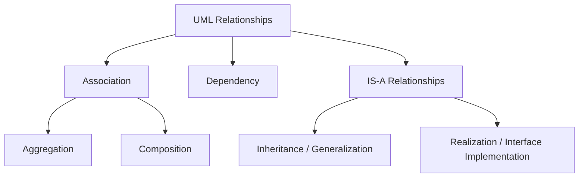

# 📊 Relationship Overview Table

| Type                         | Meaning                  | Strength |
| ---------------------------- | ------------------------ | -------- |
| Association                  | General connection       |          |
| Aggregation                  | Weak "has-a"             | ⭐⭐       |
| Composition                  | Strong "has-a"           | ⭐⭐⭐      |
| Dependency                   | Uses temporarily         | ⭐        |
| Inheritance (Generalization) | "is-a"                   | ⭐⭐⭐      |
| Realization                  | Interface implementation | ⭐⭐⭐      |

UML defines relationships such as association, dependency, generalization, and realization to model interactions between classes.

# 🔗 1. Association (General Connection)

## Meaning

Association represents a **general relationship** between two classes.

One object knows about another object.

Objects are:

* connected
* independent
* not strongly owned

## 📊 UML Diagram

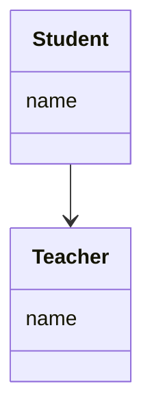

## 💻 Code Example

```java
class Teacher {}

class Student {
    Teacher teacher;
}
```

## 🧠 Technical Understanding

Here:

```java
Teacher teacher;
```

means:

* Student stores reference of Teacher
* Student can use Teacher
* Both can exist independently

## 📌 Key Insight

Association is the **most general relationship**.

It simply means:

> “These objects are related.”

## 🎯 Interview Line

> “Association represents a general connection where objects can exist independently.”

# 💎 2. Aggregation (Weak Has-A)

## Meaning

Aggregation is a **special type of association** representing weak ownership.

Whole-part relationship:

* Parent has child
* Child can still exist independently

## 📊 UML Diagram

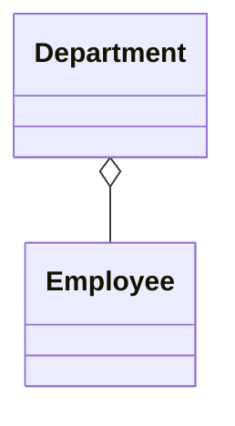

👉 `o--` = hollow diamond

## 💻 Code Example

```java
class Employee {}

class Department {
    List<Employee> employees;
}
```

## 🧠 Technical Understanding

Department contains Employees.

BUT:

* Employees are not owned completely
* Employee may move to another department
* Employee can exist even if Department is deleted

## 📌 Key Insight

> Weak ownership relationship

## 🎯 Interview Line

> “Aggregation represents a weak has-a relationship where child objects can exist independently of the parent.”

# 💣 3. Composition (Strong Has-A)

## Meaning

Composition is the strongest form of association.

It represents:

* strong ownership
* lifecycle dependency

## 📊 UML Diagram

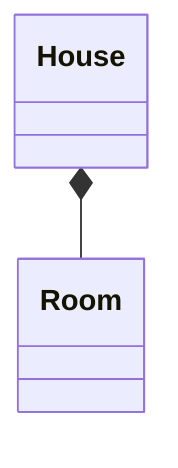

👉 `*--` = filled diamond

## 💻 Code Example

```java
class Room {}

class House {
    List<Room> rooms = new ArrayList<>();
}
```

## 🧠 Technical Understanding

Room belongs completely to House.

If House is destroyed:

❌ Rooms are also destroyed

## 📌 Key Insight

> Child lifecycle depends on parent lifecycle

## 🎯 Interview Line

> “Composition represents strong ownership where child objects cannot exist independently.”

# ⚡ 4. Dependency (Uses Temporarily)

## Meaning

Dependency represents temporary usage.

One class uses another class:

* as method parameter
* local variable
* temporary helper

No ownership exists.

## 📊 UML Diagram

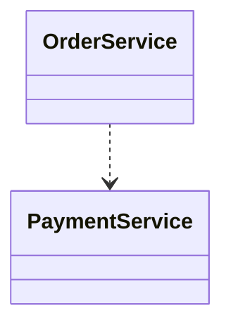

👉 `..>` = dashed dependency arrow

## 💻 Code Example

```java
class PaymentService {}

class OrderService {

    void placeOrder(PaymentService payment) {
        payment.pay();
    }
}
```

## 🧠 Technical Understanding

OrderService does not store PaymentService permanently.

It only uses it temporarily.

## 📌 Key Insight

> Weakest relationship in UML

## 🎯 Interview Line

> “Dependency represents temporary usage between classes without ownership.”

# 🧬 5. Inheritance / Generalization (IS-A)

## Meaning

Inheritance represents an **IS-A relationship**.

Child becomes specialized version of parent.

## 📊 UML Diagram

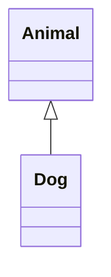

👉 `<|--` = inheritance

## 💻 Code Example

```java
class Animal {}

class Dog extends Animal {}
```

## 🧠 Technical Understanding

Dog inherits behavior and properties from Animal.

Dog IS-A Animal.

## 📌 Key Insight

Used for:

* polymorphism
* code reuse
* subtype modeling

## 🎯 Interview Line

> “Inheritance models an IS-A relationship where child classes extend parent behavior.”

# 🧩 6. Realization (Interface Implementation)

## Meaning

Realization represents interface implementation.

A class agrees to follow a contract.

## 📊 UML Diagram

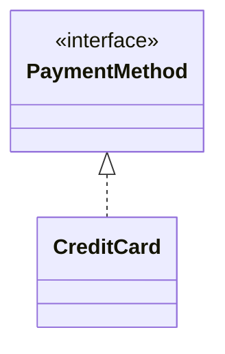

👉 `<|..` = realization

## 💻 Code Example

```java
interface PaymentMethod {
    void pay();
}

class CreditCard implements PaymentMethod {

    public void pay() {

    }
}
```

## 🧠 Technical Understanding

CreditCard provides implementation of PaymentMethod contract.

This enables:

* abstraction
* polymorphism
* DIP
* extensibility

## 🎯 Interview Line

> “Realization represents interface implementation where concrete classes fulfill abstraction contracts.”

# 📊 Complete Relationship Comparison

| Relationship | Arrow | Ownership | Lifecycle Dependency | Example                    |
| ------------ | ----- | --------- | -------------------- | -------------------------- |
| Association  | `-->` | ❌         | ❌                    | Student → Teacher          |
| Aggregation  | `o--` | Weak      | ❌                    | Department → Employee      |
| Composition  | `*--` | Strong    | ✅                    | House → Room               |
| Dependency   | `..>` | ❌         | ❌                    | Service uses helper        |
| Inheritance  | `<    | --`       | N/A                  | Dog extends Animal         |
| Realization  | `<    | ..`       | N/A                  | Class implements interface |

# 🧠 Most Important Concept

## HAS-A Relationships

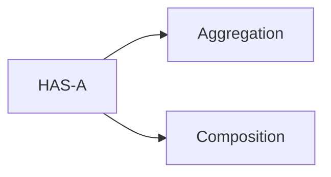

## IS-A Relationships

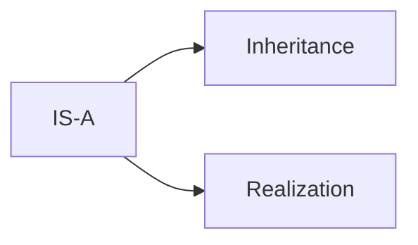

## USES-A Relationship

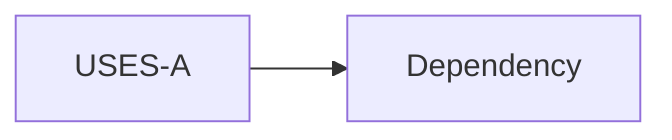

## KNOWS-A Relationship

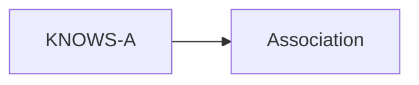

# 🔥 Real LLD Example — Payment System

## UML Diagram

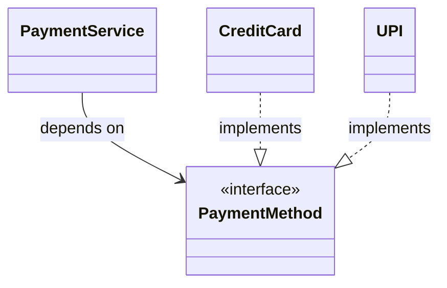

## 💻 Code

```java
interface PaymentMethod {
    void pay();
}

class CreditCard implements PaymentMethod {

    public void pay() {

    }
}

class UPI implements PaymentMethod {

    public void pay() {

    }
}

class PaymentService {

    private PaymentMethod method;

    PaymentService(PaymentMethod method) {
        this.method = method;
    }
}
```

## 🧠 Technical Explanation

* PaymentService stores reference of PaymentMethod
* This creates an association relationship
* CreditCard and UPI implement PaymentMethod
* This creates realization relationships
* Runtime polymorphism becomes possible

## 🎯 Interview Explanation

> “PaymentService depends on the PaymentMethod abstraction via association, while concrete classes use realization to implement the interface. This design enables polymorphism, extensibility, and loose coupling.”

# 🚀 How To Choose Relationship (Golden Rule)

Ask these questions:

## ❓ Is it “IS-A”?

✅ Use Inheritance

Example:

```text
Dog IS-A Animal
```

## ❓ Is it “HAS-A”?

Then ask:

| Situation        | Relationship |
| ---------------- | ------------ |
| Strong ownership | Composition  |
| Weak ownership   | Aggregation  |
| Simple reference | Association  |

## ❓ Only using temporarily?

✅ Use Dependency

## ❓ Interface involved?

✅ Use Realization

That is what interviewers actually look for.

# 🚀 Final Insight (VERY IMPORTANT)

👉 UML is not about drawing lines

👉 It’s about **expressing design decisions**

UML relationships are powerful tools to communicate:
* object ownership
* lifecycle dependency
* abstraction boundaries
* coupling strength
* runtime interaction between objects
